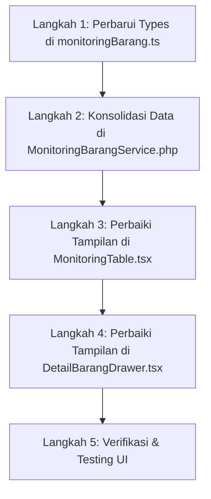

# Rencana Implementasi: Perbaikan Tampilan Monitoring Barang & Drawer Detail

Rencana ini merinci alur teknis perbaikan tampilan pada **[MonitoringTable.tsx](file:///home/ieull/projects/GTD-MOVLOG-WEB/resources/js/Pages/MonitoringBarang/components/MonitoringTable.tsx)** dan **[DetailBarangDrawer.tsx](file:///home/ieull/projects/GTD-MOVLOG-WEB/resources/js/Pages/MonitoringBarang/components/DetailBarangDrawer.tsx)** dengan mengadopsi struktur data terkonsolidasi dari **[PreviewPibStep.tsx](file:///home/ieull/projects/GTD-MOVLOG-WEB/resources/js/Pages/SubmitBerkas/components/steps/PreviewPibStep.tsx)** melalui backend **[MonitoringBarangService.php](file:///home/ieull/projects/GTD-MOVLOG-WEB/app/Services/MonitoringBarangService.php)**.

---

## User Review Required

> [!IMPORTANT]
> **Poin Kesepakatan Desain & Tampilan:**
> 1. **Tabel Monitoring ([MonitoringTable.tsx](file:///home/ieull/projects/GTD-MOVLOG-WEB/resources/js/Pages/MonitoringBarang/components/MonitoringTable.tsx)):**
>    - Kolom 1 menampilkan Nomor Kontrak (dari dokumen CI/PL) dengan Nomor Assignment sebagai identitas penugasan.
>    - Kolom 2 menampilkan seluruh barang yang diinput (bukan hanya 1 teratas) beserta tipe barang aslinya.
> 2. **Drawer Detail Barang ([DetailBarangDrawer.tsx](file:///home/ieull/projects/GTD-MOVLOG-WEB/resources/js/Pages/MonitoringBarang/components/DetailBarangDrawer.tsx)):**
>    - Subheader Drawer **hanya menampilkan Nomor Assignment** (No Kontrak dihapus dari header drawer).
>    - Menampilkan rincian seluruh barang yang diinput lengkap dengan: Nama Barang, Tipe Barang, Brand/Manufaktur, Berat (Net/Gross), Jumlah/Satuan, dan HS Code.

---

## Tahapan & Alur Eksekusi

---

## Proposed Changes

### 1. Data Layer & Types

#### [MODIFY] [monitoringBarang.ts](file:///home/ieull/projects/GTD-MOVLOG-WEB/resources/js/Pages/MonitoringBarang/types/monitoringBarang.ts)
- Memperluas interface `CiCargoDetail` agar mencakup atribut lengkap seperti pada `MergedCargoItem` di `PreviewPibStep.tsx`:
  - `netWeight?: string`
  - `grossWeight?: string`
  - `price?: string`

---

### 2. Backend Service Layer

#### [MODIFY] [MonitoringBarangService.php](file:///home/ieull/projects/GTD-MOVLOG-WEB/app/Services/MonitoringBarangService.php)
- **Logika Merging Kargo (CI + PL):**
  Menggabungkan array `cargoDetail` dari Commercial Invoice dengan `cargoDetail` dari Packing List berdasarkan indeksnya, meniru logika `mergedCargo` di `PreviewPibStep.tsx`.
- **Ekstraksi Nomor Kontrak & Nomor Assignment:**
  - `id` / `shippingSession` = `$assignmentRef` (Nomor Assignment)
  - `contractId` = `$ciData['documentDetail']['shipmentContractNumber'] ?? $plData['documentDetail']['shipmentContractNumber'] ?? '-'`
- **Ekstraksi Tipe & Brand:**
  - Memastikan tipe dan brand diambil langsung dari data kargo yang diinput, menghilangkan nilai generik "General Cargo".

---

### 3. Frontend Component: Monitoring Table

#### [MODIFY] [MonitoringTable.tsx](file:///home/ieull/projects/GTD-MOVLOG-WEB/resources/js/Pages/MonitoringBarang/components/MonitoringTable.tsx)
- **Kolom 1 (No Kontrak & No Assignment):**
  - Menampilkan Nomor Kontrak sebagai teks utama dan Nomor Assignment sebagai sub-teks referensi penugasan.
- **Kolom 2 (Daftar Barang & Tipe):**
  - Me-render seluruh item kargo dari `item.cargos`.
  - Setiap item kargo menampilkan nama barang (`cargo.descriptionOfGoods`) dan badge tipe barang aktualnya (`cargo.type`), tanpa terpotong hanya 1 item.

---

### 4. Frontend Component: Detail Barang Drawer

#### [MODIFY] [DetailBarangDrawer.tsx](file:///home/ieull/projects/GTD-MOVLOG-WEB/resources/js/Pages/MonitoringBarang/components/DetailBarangDrawer.tsx)
- **Header Drawer:**
  - Menghapus tampilan `item.contractId`, hanya menampilkan Nomor Assignment (`item.shippingSession` / `item.id`).
- **Daftar Rincian Semua Barang:**
  - Menampilkan daftar kartu untuk seluruh barang yang memuat:
    - Nama Barang (`descriptionOfGoods`)
    - Badge Tipe Barang (`type`)
    - Brand / Manufaktur (`brand`)
    - Jumlah & Satuan (`quantity` + `unit`)
    - Berat Bersih (`netWeight` kg) & Berat Kotor (`grossWeight` kg)
    - HS Code

---

## Verification Plan

### Manual Verification
1. **Verifikasi Tampilan Tabel ([MonitoringTable.tsx](file:///home/ieull/projects/GTD-MOVLOG-WEB/resources/js/Pages/MonitoringBarang/components/MonitoringTable.tsx)):**
   - Buka halaman `/monitoring-barang`.
   - Pastikan pada kolom pertama muncul Nomor Kontrak berdasarkan Nomor Assignment.
   - Pastikan kolom barang menampilkan seluruh daftar barang yang telah disubmit melalui wizard Submit Berkas (contoh: Excavator CAT 320 dan Bulldozer CAT D6R muncul bersamaan).
   - Pastikan tipe barang muncul sesuai yang diisi (contoh: `Hydraulic Excavator`, `Track-Type Tractor`), bukan `General Cargo`.
2. **Verifikasi Tampilan Drawer ([DetailBarangDrawer.tsx](file:///home/ieull/projects/GTD-MOVLOG-WEB/resources/js/Pages/MonitoringBarang/components/DetailBarangDrawer.tsx)):**
   - Klik tombol **Detail** atau baris pada tabel untuk membuka Drawer.
   - Pastikan pada header drawer **hanya ada Nomor Assignment** (tidak ada Nomor Kontrak).
   - Pastikan pada bagian rincian barang muncul seluruh barang dengan nama, tipe, brand, berat, dan jumlahnya masing-masing secara lengkap.
