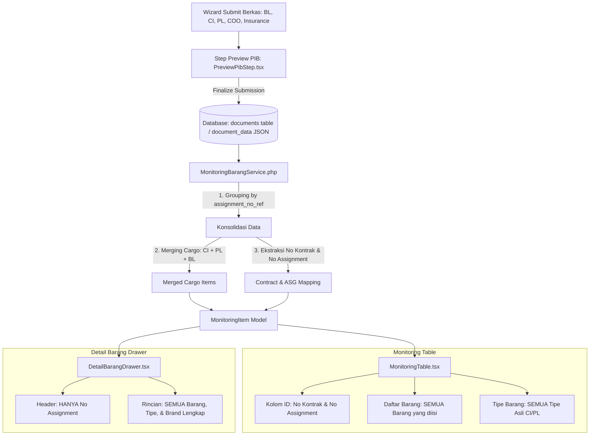

# Dokumen Analisis Permasalahan & Solusi Monitoring Barang

Dokumen ini berisi hasil analisis mendalam mengenai ketidaksesuaian tampilan pada **Monitoring Table** dan **Detail Barang Drawer**, serta perancangan alur solusi berbasis data konsolidasi dari step **Preview PIB (`PreviewPibStep.tsx`)**.

---

## 1. Analisis Akar Masalah (Root Cause Analysis)

Berdasarkan penelusuran pada alur data dari *Submit Berkas* hingga *Monitoring Barang*, ditemukan beberapa titik permasalahan utama:

### A. Permasalahan pada `MonitoringTable.tsx`
1. **Identitas Kolom (No Kontrak vs No Assignment):**
   - **Kondisi Saat Ini:** Header kolom bertuliskan `ID / No Kontrak` dan hanya menampilkan nilai `contractId`. Jika nomor kontrak belum terisi, nilainya berpotensi rancu dengan nomor penugasan (`assignment_no_ref`).
   - **Kebutuhan User:** Tabel harus menampilkan **Nomor Kontrak berdasarkan Nomor Assignment** sebagai acuan utama per baris data transaksi penugasan (relasi jelas antara No Kontrak dan No Assignment).
2. **Daftar Barang & Tipe Barang Terpotong / Tidak Lengkap:**
   - **Kondisi Saat Ini:** Pada beberapa kondisi data, tabel hanya menampilkan nama barang pertama atau representasi string tunggal (`item.itemName`), dan daftar barang tidak menampilkan seluruh item kargo yang diinput secara lengkap.
3. **Muncul Tipe Barang "General Cargo" (Bukan Tipe Asli yang Diisi):**
   - **Penyebab:** Pada step awal (Bill of Lading), field kargo belum memiliki atribut `type` dan `brand`. Ketika data diekstraksi tanpa menggabungkan (*merge*) data kargo dari step Commercial Invoice (CI) dan Packing List (PL), atau jika terjadi fallback ke tipe default/generik, tipe spesifik barang (seperti *Hydraulic Excavator*, *Track-Type Tractor*, dll.) tidak muncul dan tertimpa.

---

### B. Permasalahan pada `DetailBarangDrawer.tsx`
1. **Header Menampilkan Nomor Kontrak:**
   - **Kondisi Saat Ini:** Subheader menampilkan format gabungan `{item.contractId} • {item.shippingSession}`.
   - **Kebutuhan User:** Sesuai instruksi, pada Drawer Detail Barang **hanya menampilkan Nomor Assignment** (`item.shippingSession` / `item.id`), tanpa perlu menampilkan Nomor Kontrak.
2. **Tampilan Informasi Barang Masih Tunggal:**
   - **Kondisi Saat Ini:** Kotak spesifikasi kargo di bagian atas Drawer menampilkan satu nilai `item.itemType` dan `item.manufacturer`, sehingga jika satu penugasan memiliki beberapa jenis barang dengan brand berbeda, informasi tersebut tidak merefleksikan seluruh barang.
3. **Daftar Rincian Barang Kurang Lengkap:**
   - **Kebutuhan User:** Drawer harus menampilkan seluruh barang yang diinput beserta **Nama Barang**, **Tipe Barang**, **Nama Brand**, **Jumlah & Satuan**, **Net Weight**, dan **HS Code** untuk setiap item kargo tanpa terkecuali.

---

### C. Kesenjangan Sumber Data Backend (`MonitoringBarangService.php`) vs `PreviewPibStep.tsx`
- Pada frontend step `PreviewPibStep.tsx`, data kargo sudah berhasil dikonsolidasi dengan menggabungkan data dari:
  - **Commercial Invoice (CI):** `descriptionOfGoods`, `type`, `brand`, `quantityOfGoods`, `goodsUnitMeasurement`, `quantityOfPackage`, `packageUnitMeasurement`, `priceOfGoods`, `currency`, `hsCodePol`, `hsCodePod`.
  - **Packing List (PL):** `netWeight`, `grossWeight`, `volumeDimension`.
  - **Bill of Lading (BL):** `totalGrossWeight`, `totalVolume`, `portOfLoading`, `portOfDischarge`.
- Di backend (`MonitoringBarangService.php`), proses pemetaan saat ini baru membaca sebagian array dari salah satu dokumen (prioritas CI) tanpa melakukan penggabungan data terintegrasi (*merged cargo item*) seperti yang dilakukan oleh `PreviewPibStep.tsx`.

---

## 2. Alur Solusi & Perubahan Arsitektur Data

Untuk memastikan data di Monitoring Barang 100% konsisten dengan data yang tersimpan dan ditampilkan pada step **Preview PIB**, berikut adalah alur perbaikan yang dirancang:



---

## 3. Rincian Rencana Perubahan Komponen

### 1. Penyesuaian Backend: `app/Services/MonitoringBarangService.php`
- **Konsolidasi Merged Cargo:**
  Menerapkan algoritma penggabungan array `cargoDetail` dari Commercial Invoice dengan `cargoDetail` dari Packing List (mencocokkan index kargo), sehingga setiap item kargo memiliki data lengkap:
  - `id`, `descriptionOfGoods`, `type`, `brand`, `quantity`, `unit`, `netWeight`, `grossWeight`, `price`, `hsCode`.
- **Ekstraksi Kontrak & Assignment yang Jelas:**
  - `id` / `shippingSession` = `assignment_no_ref`
  - `contractId` = `shipmentContractNumber` dari CI/PL (atau fallback jika belum ada)
- **Tipe & Brand Terpadu:**
  - Memastikan `itemTypes` dan `itemBrands` menampung seluruh tipe dan brand yang unik dari kargo tanpa nilai default generik ("General Cargo").

### 2. Penyesuaian Types: `resources/js/Pages/MonitoringBarang/types/monitoringBarang.ts`
- Memperluas interface `CiCargoDetail` menjadi model kargo terpadu yang mencakup field berat dan harga:
  ```typescript
  export interface CiCargoDetail {
    id: string;
    descriptionOfGoods: string;
    type: string;
    brand: string;
    quantity?: number | string;
    unit?: string;
    netWeight?: string;
    grossWeight?: string;
    price?: string;
    hsCode?: string;
  }
  ```

### 3. Penyesuaian Tampilan: `resources/js/Pages/MonitoringBarang/components/MonitoringTable.tsx`
- **Kolom Identifikasi (Kolom 1):**
  Menampilkan Nomor Kontrak yang berelasi langsung dengan Nomor Assignment:
  - Teks utama: **No Kontrak** (contoh: `SC-2024-0456`)
  - Sub-teks: **No Assignment** (contoh: `ASG-20260828-ABC123`)
- **Kolom Daftar Barang & Tipe (Kolom 2):**
  Melakukan iterasi ke seluruh `item.cargos` untuk menampilkan:
  - Nama barang (`descriptionOfGoods`) untuk **setiap item** (bukan hanya 1 teratas).
  - Badge tipe barang spesifik (`cargo.type`) untuk **setiap item** (misal: *Hydraulic Excavator*, *Track-Type Tractor*), tanpa menampilkan teks generik "General Cargo".

### 4. Penyesuaian Tampilan: `resources/js/Pages/MonitoringBarang/components/DetailBarangDrawer.tsx`
- **Header Drawer:**
  - Mengubah subheader agar **hanya menampilkan Nomor Assignment** (menghapus tampilan No Kontrak di header drawer).
- **Bagian Rincian Semua Barang:**
  - Menampilkan seluruh item barang dengan informasi detail:
    - Nama Barang (`descriptionOfGoods`)
    - Badge Tipe Barang (`type`)
    - Manufaktur / Brand (`brand`)
    - Jumlah & Satuan (`quantity` + `unit`)
    - Berat Bersih (`netWeight` kg) & Berat Kotor (`grossWeight` kg)
    - HS Code

---

## 4. Kesimpulan

Dengan menyelaraskan logika ekstraksi data backend dan rendering komponen frontend ke standar data **Preview PIB (`PreviewPibStep.tsx`)**, seluruh data barang, tipe barang, brand, serta relasi nomor kontrak dan assignment akan tampil secara akurat, lengkap, dan informatif.
