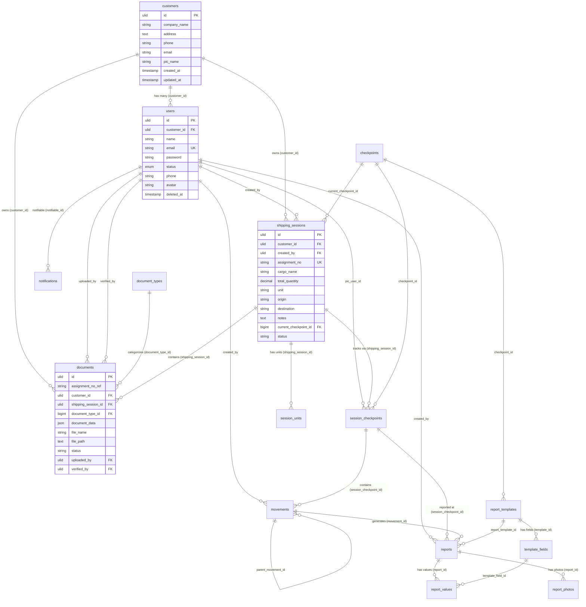
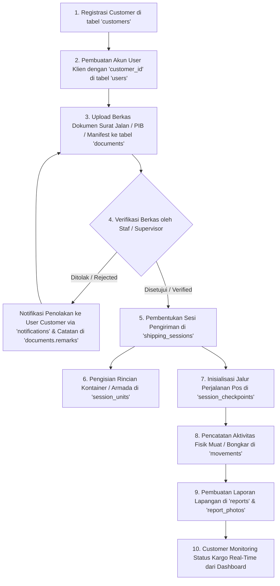

# Dokumentasi Skema Basis Data & Relasi Tabel Terkait Customer (GTD-MoveLog)

Dokumen ini menjelaskan secara menyeluruh arsitektur basis data, struktur tabel, tipe data, indeks, constraint, dan relasi antar entitas yang berkaitan langsung maupun tidak langsung dengan entitas **Customer** pada sistem logistik **GTD-MoveLog**.

---

## 1. Ringkasan Eksekutif & Struktur Entitas

Pada sistem **GTD-MoveLog**, entitas `Customer` merupakan entitas inti (*core entity*) bisnis yang merepresentasikan **perusahaan klien/pemilik barang**. Data operasional logistik, autentikasi pengguna perwakilan klien, unggahan dokumen berkas (manifest/surat jalan/PIB), hingga pemantauan kargo di lapangan terhubung secara relasional dengan `Customer`.

Secara hirarki, keterkaitan tabel terhadap `Customer` terbagi menjadi 3 tingkatan (Level):

1. **Level 0 (Core Table):**
   - [`customers`](#1-tabel-customers-master-data-perusahaan-klien): Master data profil perusahaan customer/klien.
2. **Level 1 (Direct Relationships / Foreign Key Langsung):**
   - [`users`](#2-tabel-users-autentikasi--personel-customer): Akun pengguna dengan role customer yang terafiliasi ke perusahaan (`customer_id`).
   - [`shipping_sessions`](#3-tabel-shipping_sessions-sesi-pengiriman-kargo): Sesi transaksi pengiriman kargo milik customer (`customer_id`).
   - [`documents`](#4-tabel-documents-berkas-dan-arsip-dokumen): Berkas digital (Surat Jalan, PIB, DO, Manifest) milik customer (`customer_id`).
3. **Level 2 & Level 3 (Downstream / Operational Relationships):**
   - [`document_types`](#5-tabel-document_types-master-jenis-dokumen): Master jenis dokumen kargo.
   - [`session_units`](#6-tabel-session_units-rincian-unit-kargo--kontainer): Daftar kontainer/armada/unit muatan dalam sesi pengiriman customer.
   - [`session_checkpoints`](#7-tabel-session_checkpoints-pos-pemeriksaan-perjalanan): Milestone titik pos kontrol yang dilalui kargo customer.
   - [`checkpoints`](#8-tabel-checkpoints-master-pos-checkpoint): Master titik lokasi pos pemeriksaan.
   - [`movements`](#9-tabel-movements-aktivitas-pergerakan-kargo): Aktivitas pemindahan kargo fisik (loading, unloading, hauling).
   - [`reports`](#10-tabel-reports-laporan-lapangan): Laporan progres/kejadian penanganan barang di lapangan.
   - [`report_values`](#11-tabel-report_values-nilai-input-dinamis-laporan): Nilai isian form dinamis laporan.
   - [`report_photos`](#12-tabel-report_photos-foto-bukti-dokumentasi): Foto dokumentasi visual penanganan kargo customer.
   - [`report_templates`](#13-tabel-report_templates-template-laporan) & [`template_fields`](#14-tabel-template_fields-definisi-kolom-template): Konfigurasi formulir dinamis laporan checkpoint.
   - [`notifications`](#15-tabel-notifications-notifikasi-sistem): Notifikasi status verifikasi/penolakan dokumen ke user customer.

---

## 2. Entity-Relationship Diagram (ERD)

---

## 3. Rincian Detail Masing-Masing Tabel

### 1. Tabel `customers` (Master Data Perusahaan Klien)
* **File Migration:** `database/migrations/2026_07_13_185817_create_customers_table.php`
* **Model Eloquent:** `App\Models\Customer` (menggunakan Trait `HasUlids`).
* **Deskripsi:** Tabel sentral untuk menyimpan profil legal dan kontak entitas klien/customer pemilik kargo logistik.

| Nama Kolom | Tipe Data | Constraint / Atribut | Keterangan & Fungsi Bisnis |
| :--- | :--- | :--- | :--- |
| `id` | `CHAR(26)` (ULID) | `PRIMARY KEY` | Identifier unik berupa ULID (*lexicographically sortable*). |
| `company_name` | `VARCHAR(255)` | `NOT NULL` | Nama resmi perusahaan klien (misal: "PT Maju Logistik Mandiri"). |
| `address` | `TEXT` | `NULLABLE` | Alamat kantor pusat atau fasilitas operasional klien. |
| `phone` | `VARCHAR(255)` | `NULLABLE` | Nomor telepon resmi perusahaan. |
| `email` | `VARCHAR(255)` | `NULLABLE` | Email korespondensi resmi perusahaan. |
| `pic_name` | `VARCHAR(255)` | `NULLABLE` | Nama Person In Charge (PIC) utama klien. |
| `created_at` | `TIMESTAMP` | `NULLABLE` | Waktu data customer pertama kali didaftarkan. |
| `updated_at` | `TIMESTAMP` | `NULLABLE` | Waktu terakhir data customer diperbarui. |

#### Relasi Eloquent pada Model `Customer`:
* `users()`: `HasMany` ke `User` via `customer_id`.
* `shippingSessions()`: `HasMany` ke `ShippingSession` via `customer_id`.

---

### 2. Tabel `users` (Autentikasi & Personel Customer)
* **File Migration:** `database/migrations/0001_01_01_000000_create_users_table.php` & `2026_08_27_000001_add_customer_id_to_users_table.php`
* **Model Eloquent:** `App\Models\User` (menggunakan `HasUlids`, `HasRoles`, `SoftDeletes`, `Notifiable`).
* **Deskripsi:** Menyimpan kredensial akun pengguna sistem. Jika user memiliki role `customer`, kolom `customer_id` akan mereferensikan ke perusahaan `customers` tempat ia bernaung.

| Nama Kolom | Tipe Data | Constraint / Atribut | Keterangan & Fungsi Bisnis |
| :--- | :--- | :--- | :--- |
| `id` | `CHAR(26)` (ULID) | `PRIMARY KEY` | Identifier unik akun user. |
| `customer_id` | `CHAR(26)` (ULID) | `NULLABLE`, `FK -> customers(id)` | Referensi perusahaan klien (`ON DELETE SET NULL`). Bernilai NULL jika user staf internal. |
| `name` | `VARCHAR(255)` | `NOT NULL` | Nama lengkap pengguna. |
| `email` | `VARCHAR(255)` | `NOT NULL`, `UNIQUE` | Alamat email unik untuk autentikasi login. |
| `email_verified_at` | `TIMESTAMP` | `NULLABLE` | Waktu verifikasi email. |
| `password` | `VARCHAR(255)` | `NOT NULL` | Hash password pengguna. |
| `status` | `ENUM` | `DEFAULT 'active'` | Nilai status akun: `active`, `inactive`, `pending`. |
| `phone` | `VARCHAR(20)` | `NULLABLE` | Nomor handphone/WhatsApp pengguna. |
| `avatar` | `VARCHAR(255)` | `NULLABLE` | Path file foto profil user. |
| `remember_token` | `VARCHAR(100)` | `NULLABLE` | Token sesi remember-me. |
| `created_at` / `updated_at` | `TIMESTAMP` | `NULLABLE` | Timestamps. |
| `deleted_at` | `TIMESTAMP` | `NULLABLE` | Timestamp soft delete akun. |

#### Relasi Eloquent pada Model `User`:
* `customer()`: `BelongsTo` ke `Customer` via `customer_id`.
* `uploadedDocuments()`: `HasMany` ke `Document` via `uploaded_by`.
* `shippingSessions()`: `HasMany` ke `ShippingSession` via `created_by`.

---

### 3. Tabel `shipping_sessions` (Sesi Pengiriman Kargo)
* **File Migration:** `database/migrations/2026_07_13_190059_create_shipping_sessions_table.php` & `2026_08_24_000002_add_notes_to_shipping_sessions_table.php`
* **Model Eloquent:** `App\Models\ShippingSession` (menggunakan `HasUlids`).
* **Deskripsi:** Menyimpan transaksi operasional sesi pengiriman kargo milik customer tertentu dari origin ke destination.

| Nama Kolom | Tipe Data | Constraint / Atribut | Keterangan & Fungsi Bisnis |
| :--- | :--- | :--- | :--- |
| `id` | `CHAR(26)` (ULID) | `PRIMARY KEY` | Identifier unik sesi pengiriman. |
| `customer_id` | `CHAR(26)` (ULID) | `NOT NULL`, `FK -> customers(id)` | Pemilik kargo (`ON UPDATE CASCADE`, `ON DELETE RESTRICT`). |
| `created_by` | `CHAR(26)` (ULID) | `NOT NULL`, `FK -> users(id)` | User pembuat sesi (`ON UPDATE CASCADE`, `ON DELETE RESTRICT`). |
| `assignment_no` | `VARCHAR(255)` | `NOT NULL`, `UNIQUE` | Nomor unik penugasan pengiriman (misal: `ASN-202608-0001`). |
| `cargo_name` | `VARCHAR(255)` | `NOT NULL` | Nama/jenis komoditas muatan kargo (misal: "Batu Bara", "Raw Sugar"). |
| `total_quantity` | `DECIMAL(12,2)` | `NOT NULL` | Total tonase/jumlah kargo yang dikirim. |
| `unit` | `VARCHAR(255)` | `NOT NULL` | Satuan muatan (misal: `TON`, `KGS`, `M3`, `UNIT`). |
| `origin` | `VARCHAR(255)` | `NULLABLE` | Lokasi titik muat/asal pengiriman. |
| `destination` | `VARCHAR(255)` | `NULLABLE` | Lokasi titik bongkar/tujuan akhir pengiriman. |
| `notes` | `TEXT` | `NULLABLE` | Catatan atau instruksi khusus penanganan kargo. |
| `current_checkpoint_id` | `BIGINT UNSIGNED` | `NULLABLE`, `FK -> checkpoints(id)` | Posisi pos checkpoint kargo saat ini (`ON DELETE SET NULL`). |
| `status` | `VARCHAR(255)` | `DEFAULT 'DRAFT'` | Status pengiriman (`pending`, `in_transit`, `delivered`, `cancelled`). |
| `created_at` / `updated_at` | `TIMESTAMP` | `NULLABLE` | Timestamps. |

#### Relasi Eloquent pada Model `ShippingSession`:
* `customer()`: `BelongsTo` ke `Customer` via `customer_id`.
* `createdBy()`: `BelongsTo` ke `User` via `created_by`.
* `currentCheckpoint()`: `BelongsTo` ke `Checkpoint` via `current_checkpoint_id`.
* `documents()`: `HasMany` ke `Document` via `shipping_session_id`.
* `units()`: `HasMany` ke `SessionUnit` via `shipping_session_id`.
* `sessionCheckpoints()`: `HasMany` ke `SessionCheckpoint` via `shipping_session_id`.

---

### 4. Tabel `documents` (Berkas dan Arsip Dokumen)
* **File Migration:** `database/migrations/2026_07_13_190115_create_documents_table.php`
* **Model Eloquent:** `App\Models\Document` (menggunakan `HasUlids`).
* **Deskripsi:** Berkas digital yang diunggah oleh customer/staf untuk kebutuhan administrasi kepabeanan, logistik, dan verifikasi muatan.

| Nama Kolom | Tipe Data | Constraint / Atribut | Keterangan & Fungsi Bisnis |
| :--- | :--- | :--- | :--- |
| `id` | `CHAR(26)` (ULID) | `PRIMARY KEY` | Identifier unik berkas dokumen. |
| `assignment_no_ref` | `VARCHAR(255)` | `NOT NULL`, `INDEX` | Nomor referensi penugasan berkas (sebelum/sesudah sesi terbentuk). |
| `customer_id` | `CHAR(26)` (ULID) | `NOT NULL`, `FK -> customers(id)` | Perusahaan pemilik dokumen (`ON UPDATE CASCADE`, `ON DELETE RESTRICT`). |
| `shipping_session_id` | `CHAR(26)` (ULID) | `NULLABLE`, `FK -> shipping_sessions(id)`, `INDEX` | Kaitan ke sesi pengiriman (`ON UPDATE CASCADE`, `ON DELETE CASCADE`). |
| `document_type_id` | `BIGINT UNSIGNED` | `NOT NULL`, `FK -> document_types(id)` | Jenis tipe dokumen (`ON UPDATE CASCADE`, `ON DELETE RESTRICT`). |
| `document_data` | `JSON` | `NOT NULL` | Data terurai hasil parsing berkas (nomor dokumen, party, tgl, dll). |
| `file_name` | `VARCHAR(255)` | `NOT NULL` | Nama asli file saat diunggah. |
| `file_path` | `TEXT` | `NOT NULL` | Lokasi path fisik penyimpanan berkas di storage. |
| `status` | `VARCHAR(255)` | `DEFAULT 'PENDING'` | Status verifikasi berkas: `DRAFT`, `PENDING`, `VERIFIED`, `REJECTED`. |
| `uploaded_by` | `CHAR(26)` (ULID) | `NOT NULL`, `FK -> users(id)` | Akun user yang mengunggah dokumen. |
| `uploaded_at` | `TIMESTAMP` | `DEFAULT CURRENT_TIMESTAMP` | Waktu dokumen diunggah. |
| `verified_by` | `CHAR(26)` (ULID) | `NULLABLE`, `FK -> users(id)` | Verifikator yang menyetujui/menolak berkas. |
| `verified_at` | `TIMESTAMP` | `NULLABLE` | Waktu verifikasi dilakukan. |
| `remarks` | `TEXT` | `NULLABLE` | Catatan koreksi/alasan jika dokumen ditolak (*rejected*). |
| `created_at` / `updated_at` | `TIMESTAMP` | `NULLABLE` | Timestamps. |

* **Index Unik Komposit:** `UNIQUE ('assignment_no_ref', 'document_type_id')`.

#### Relasi Eloquent pada Model `Document`:
* `customer()`: `BelongsTo` ke `Customer` via `customer_id`.
* `shippingSession()`: `BelongsTo` ke `ShippingSession` via `shipping_session_id`.
* `documentType()`: `BelongsTo` ke `DocumentType` via `document_type_id`.
* `uploadedBy()`: `BelongsTo` ke `User` via `uploaded_by`.
* `verifiedBy()`: `BelongsTo` ke `User` via `verified_by`.

---

### 5. Tabel `document_types` (Master Jenis Dokumen)
* **File Migration:** `database/migrations/2026_07_13_185958_create_document_types_table.php`
* **Model Eloquent:** `App\Models\DocumentType`
* **Deskripsi:** Master data untuk kategori dokumen yang diwajibkan dalam alur kepabeanan dan logistik kargo customer (contoh: PIB, Surat Jalan, Packing List, Invoice, DO).

| Nama Kolom | Tipe Data | Constraint | Keterangan |
| :--- | :--- | :--- | :--- |
| `id` | `BIGINT UNSIGNED` | `AUTO_INCREMENT`, `PK` | ID primer tipe dokumen. |
| `name` | `VARCHAR(255)` | `NOT NULL`, `UNIQUE` | Kode/nama jenis dokumen (misal: `PIB`, `SURAT_JALAN`). |
| `description` | `TEXT` | `NULLABLE` | Deskripsi kegunaan berkas. |
| `created_at` / `updated_at` | `TIMESTAMP` | `NULLABLE` | Timestamps. |

---

### 6. Tabel `session_units` (Rincian Unit Kargo / Kontainer)
* **File Migration:** `database/migrations/2026_08_24_000001_create_session_units_table.php`
* **Model Eloquent:** `App\Models\SessionUnit` (menggunakan `HasUlids`).
* **Deskripsi:** Menyimpan rincian nomor unit kontainer, nomor polisi armada truk, atau lambung tongkang yang membawa kargo milik customer pada sesi terkait.

| Nama Kolom | Tipe Data | Constraint | Keterangan |
| :--- | :--- | :--- | :--- |
| `id` | `CHAR(26)` (ULID) | `PRIMARY KEY` | Identifier unik unit sesi. |
| `shipping_session_id` | `CHAR(26)` (ULID) | `NOT NULL`, `FK -> shipping_sessions(id)` | Sesi pengiriman induk (`ON DELETE CASCADE`). |
| `unit_name` | `VARCHAR(255)` | `NOT NULL` | Identitas unit (misal: "Kontainer TEMU1234567"). |
| `quantity` | `UNSIGNED INT` | `DEFAULT 1` | Jumlah muatan dalam unit. |
| `notes` | `TEXT` | `NULLABLE` | Catatan kondisi unit / nomor segel (*seal number*). |
| `created_at` / `updated_at` | `TIMESTAMP` | `NULLABLE` | Timestamps. |

---

### 7. Tabel `session_checkpoints` (Pos Pemeriksaan Perjalanan)
* **File Migration:** `database/migrations/2026_07_13_190131_create_session_checkpoints_table.php`
* **Model Eloquent:** `App\Models\SessionCheckpoint` (menggunakan `HasUlids`).
* **Deskripsi:** Pos-pos kontrol pemeriksaan yang harus dilalui oleh kargo customer selama perjalanan pengiriman.

| Nama Kolom | Tipe Data | Constraint | Keterangan |
| :--- | :--- | :--- | :--- |
| `id` | `CHAR(26)` (ULID) | `PRIMARY KEY` | Identifier unik session checkpoint. |
| `shipping_session_id` | `CHAR(26)` (ULID) | `NOT NULL`, `FK -> shipping_sessions(id)` | Sesi pengiriman kargo (`ON DELETE CASCADE`). |
| `checkpoint_id` | `BIGINT UNSIGNED` | `NOT NULL`, `FK -> checkpoints(id)` | Master checkpoint yang dilewati (`ON DELETE RESTRICT`). |
| `pic_user_id` | `CHAR(26)` (ULID) | `NULLABLE`, `FK -> users(id)` | Petugas lapangan penanggung jawab di pos tersebut. |
| `status` | `VARCHAR(255)` | `NOT NULL` | Status pos: `PENDING`, `IN_PROGRESS`, `COMPLETED`, `SKIPPED`. |
| `actual_start` | `TIMESTAMP` | `NULLABLE` | Waktu kargo tiba di pos checkpoint. |
| `actual_finish` | `TIMESTAMP` | `NULLABLE` | Waktu kargo selesai diproses dan diberangkatkan dari pos. |
| `sync_status` | `VARCHAR(255)` | `DEFAULT 'SYNCED'` | Status sinkronisasi aplikasi mobile. |
| `created_at` / `updated_at` | `TIMESTAMP` | `NULLABLE` | Timestamps. |

* **Index Unik Komposit:** `UNIQUE ('shipping_session_id', 'checkpoint_id')`.

---

### 8. Tabel `checkpoints` (Master Pos Checkpoint)
* **File Migration:** `database/migrations/2026_07_13_185901_create_checkpoints_table.php`
* **Model Eloquent:** `App\Models\Checkpoint`
* **Deskripsi:** Master data konfigurasi urutan pos kontrol pemeriksaan (contoh: "Gate In Pelabuhan", "Dermaga Muat", "Timbangan").

| Nama Kolom | Tipe Data | Constraint | Keterangan |
| :--- | :--- | :--- | :--- |
| `id` | `BIGINT UNSIGNED` | `AUTO_INCREMENT`, `PK` | ID primer checkpoint. |
| `name` | `VARCHAR(255)` | `NOT NULL` | Nama checkpoint. |
| `sequence` | `INTEGER` | `NOT NULL` | Urutan alur pos dalam SOP pengiriman. |
| `description` | `TEXT` | `NULLABLE` | Deskripsi kegiatan pos. |
| `created_at` / `updated_at` | `TIMESTAMP` | `NULLABLE` | Timestamps. |

---

### 9. Tabel `movements` (Aktivitas Pergerakan Kargo)
* **File Migration:** `database/migrations/2026_07_13_190152_create_movements_table.php`
* **Model Eloquent:** `App\Models\Movement` (menggunakan `HasUlids`).
* **Deskripsi:** Mencatat setiap aktivitas fisik penanganan kargo customer di checkpoint (misal pemuatan dari dermaga ke tongkang). Mendukung struktur hierarki induk-anak (*nested movement*).

| Nama Kolom | Tipe Data | Constraint | Keterangan |
| :--- | :--- | :--- | :--- |
| `id` | `CHAR(26)` (ULID) | `PRIMARY KEY` | Identifier unik pergerakan. |
| `session_checkpoint_id` | `CHAR(26)` (ULID) | `NOT NULL`, `FK -> session_checkpoints(id)`, `INDEX` | Checkpoint tempat aktivitas berlangsung (`ON DELETE CASCADE`). |
| `parent_movement_id` | `CHAR(26)` (ULID) | `NULLABLE`, `FK -> movements(id)`, `INDEX` | ID movement induk jika berupa sub-aktivitas (`ON DELETE SET NULL`). |
| `movement_name` | `VARCHAR(255)` | `NOT NULL` | Nama pergerakan (misal: "Pemuatan Kargo ke Tongkang GTD 01"). |
| `movement_type` | `VARCHAR(255)` | `NOT NULL` | Tipe aktivitas: `LOADING`, `UNLOADING`, `HAULING`, `TRANSSHIPMENT`. |
| `sequence` | `INTEGER` | `DEFAULT 0` | Urutan langkah aktivitas. |
| `status` | `VARCHAR(255)` | `NOT NULL` | Status pekerjaan: `PENDING`, `IN_PROGRESS`, `COMPLETED`. |
| `created_by` | `CHAR(26)` (ULID) | `NOT NULL`, `FK -> users(id)` | Petugas lapangan yang mencatat pergerakan. |
| `created_at` / `updated_at` | `TIMESTAMP` | `NULLABLE` | Timestamps. |

---

### 10. Tabel `reports` (Laporan Lapangan)
* **File Migration:** `database/migrations/2026_07_13_190220_create_reports_table.php`
* **Model Eloquent:** `App\Models\Report` (menggunakan `HasUlids`).
* **Deskripsi:** Laporan berkala atau insidental yang dibuat oleh petugas lapangan terkait penanganan barang customer di setiap checkpoint atau pergerakan kargo.

| Nama Kolom | Tipe Data | Constraint | Keterangan |
| :--- | :--- | :--- | :--- |
| `id` | `CHAR(26)` (ULID) | `PRIMARY KEY` | Identifier unik laporan. |
| `session_checkpoint_id` | `CHAR(26)` (ULID) | `NULLABLE`, `FK -> session_checkpoints(id)`, `INDEX` | Checkpoint yang dilaporkan (`ON DELETE SET NULL`). |
| `movement_id` | `CHAR(26)` (ULID) | `NULLABLE`, `FK -> movements(id)`, `INDEX` | Movement spesifik yang dilaporkan (`ON DELETE SET NULL`). |
| `report_template_id` | `BIGINT UNSIGNED` | `NOT NULL`, `FK -> report_templates(id)` | Format form laporan yang digunakan (`ON DELETE RESTRICT`). |
| `event_at` | `TIMESTAMP` | `NULLABLE` | Waktu aktual peristiwa/pekerjaan terjadi di lapangan. |
| `report_type` | `VARCHAR(255)` | `NOT NULL` | Tipe laporan (`DAILY`, `PROGRESS`, `INCIDENT`, `HANDOVER`). |
| `moved_quantity` | `DECIMAL(12,2)` | `NULLABLE` | Jumlah tonase kargo yang telah tertangani pada laporan ini. |
| `description` | `TEXT` | `NULLABLE` | Catatan naratif jalannya operasional atau kendala. |
| `latitude` | `DECIMAL(10,7)` | `NULLABLE` | Koordinat Latitude GPS pelaporan. |
| `longitude` | `DECIMAL(10,7)` | `NULLABLE` | Koordinat Longitude GPS pelaporan. |
| `created_by` | `CHAR(26)` (ULID) | `NOT NULL`, `FK -> users(id)` | Petugas pembuat laporan. |
| `sync_status` | `VARCHAR(255)` | `DEFAULT 'SYNCED'` | Status sinkronisasi mobile. |
| `created_at` / `updated_at` | `TIMESTAMP` | `NULLABLE` | Timestamps. |

---

### 11. Tabel `report_values` (Nilai Input Dinamis Laporan)
* **File Migration:** `database/migrations/2026_07_13_190243_create_report_values_table.php`
* **Model Eloquent:** `App\Models\ReportValue`
* **Deskripsi:** Menyimpan nilai isian field dinamis dari form template laporan tertentu (misal: "Kecepatan Angin", "Kondisi Cuaca", "Draft Kapal").

| Nama Kolom | Tipe Data | Constraint | Keterangan |
| :--- | :--- | :--- | :--- |
| `id` | `BIGINT UNSIGNED` | `AUTO_INCREMENT`, `PK` | ID primer nilai field. |
| `report_id` | `CHAR(26)` (ULID) | `NOT NULL`, `FK -> reports(id)` | Laporan induk (`ON DELETE CASCADE`). |
| `template_field_id` | `BIGINT UNSIGNED` | `NOT NULL`, `FK -> template_fields(id)` | Kolom template terkait (`ON DELETE RESTRICT`). |
| `value` | `TEXT` | `NULLABLE` | Nilai data yang diisi oleh petugas. |
| `created_at` / `updated_at` | `TIMESTAMP` | `NULLABLE` | Timestamps. |

* **Index Unik Komposit:** `UNIQUE ('report_id', 'template_field_id')`.

---

### 12. Tabel `report_photos` (Foto Bukti Dokumentasi)
* **File Migration:** `database/migrations/2026_07_13_190305_create_report_photos_table.php`
* **Model Eloquent:** `App\Models\ReportPhoto` (menggunakan `HasUlids`).
* **Deskripsi:** Foto dokumentasi visual kondisi muatan kargo customer di lapangan.

| Nama Kolom | Tipe Data | Constraint | Keterangan |
| :--- | :--- | :--- | :--- |
| `id` | `CHAR(26)` (ULID) | `PRIMARY KEY` | Identifier unik foto. |
| `report_id` | `CHAR(26)` (ULID) | `NOT NULL`, `FK -> reports(id)`, `INDEX` | Laporan induk foto (`ON DELETE CASCADE`). |
| `photo_url` | `TEXT` | `NOT NULL` | URL / path lokasi file gambar di storage. |
| `caption` | `TEXT` | `NULLABLE` | Keterangan foto dokumentasi. |
| `sort_order` | `INTEGER` | `DEFAULT 0` | Urutan penataan foto. |
| `is_cover` | `BOOLEAN` | `DEFAULT false` | Penanda foto sampul utama laporan. |
| `taken_at` | `TIMESTAMP` | `NULLABLE` | Waktu pengambilan foto dari perangkat mobile. |
| `created_at` / `updated_at` | `TIMESTAMP` | `NULLABLE` | Timestamps. |

---

### 13. Tabel `report_templates` & 14. Tabel `template_fields` (Template Laporan Dinamis)
* **File Migration:** `database/migrations/2026_07_13_190027_create_report_templates_table.php` & `2026_07_13_190042_create_template_fields_table.php`
* **Model Eloquent:** `App\Models\ReportTemplate` dan `App\Models\TemplateField`

#### Skema `report_templates`:
| Nama Kolom | Tipe Data | Constraint | Keterangan |
| :--- | :--- | :--- | :--- |
| `id` | `BIGINT UNSIGNED` | `AUTO_INCREMENT`, `PK` | ID template. |
| `checkpoint_id` | `BIGINT UNSIGNED` | `NOT NULL`, `FK -> checkpoints(id)` | Checkpoint pengguna template (`ON DELETE RESTRICT`). |
| `name` | `VARCHAR(255)` | `NOT NULL` | Nama template formulir. |
| `description` | `TEXT` | `NULLABLE` | Penjelasan template. |
| `applies_to_report_type` | `VARCHAR(255)` | `NOT NULL` | Kategori laporan terkait (`DAILY`, `PROGRESS`, dll). |
| `created_at` / `updated_at` | `TIMESTAMP` | `NULLABLE` | Timestamps. |

#### Skema `template_fields`:
| Nama Kolom | Tipe Data | Constraint | Keterangan |
| :--- | :--- | :--- | :--- |
| `id` | `BIGINT UNSIGNED` | `AUTO_INCREMENT`, `PK` | ID field. |
| `template_id` | `BIGINT UNSIGNED` | `NOT NULL`, `FK -> report_templates(id)` | Template induk (`ON DELETE CASCADE`). |
| `field_name` | `VARCHAR(255)` | `NOT NULL` | Label input formulir. |
| `field_type` | `VARCHAR(255)` | `NOT NULL` | Tipe data input (`text`, `number`, `select`, `date`). |
| `required` | `BOOLEAN` | `DEFAULT false` | Apakah wajib diisi oleh petugas. |
| `sort_order` | `INTEGER` | `DEFAULT 0` | Urutan posisi input form di antarmuka. |
| `created_at` / `updated_at` | `TIMESTAMP` | `NULLABLE` | Timestamps. |

---

### 15. Tabel `notifications` (Notifikasi Sistem)
* **File Migration:** `database/migrations/2026_08_28_083532_create_notifications_table.php`
* **Deskripsi:** Tabel polymorphic notification Laravel untuk mengirimkan pemberitahuan ke user (termasuk user customer), misalnya saat berkas dokumen pengiriman disetujui atau ditolak (`DocumentRejectedNotification`).

| Nama Kolom | Tipe Data | Constraint | Keterangan |
| :--- | :--- | :--- | :--- |
| `id` | `CHAR(36)` (UUID) | `PRIMARY KEY` | Identifier notifikasi. |
| `type` | `VARCHAR(255)` | `NOT NULL` | Nama class notification (misal: `App\Notifications\DocumentRejectedNotification`). |
| `notifiable_type` | `VARCHAR(255)` | `NOT NULL` | Model target (misal: `App\Models\User`). |
| `notifiable_id` | `VARCHAR(36)` | `NOT NULL` | ID user penerima (`users.id`). |
| `data` | `TEXT` / `JSON` | `NOT NULL` | Payload pesan notifikasi (judul, alasan penolakan, assignment_no, URL link). |
| `read_at` | `TIMESTAMP` | `NULLABLE` | Waktu notifikasi dibaca user. |
| `created_at` / `updated_at` | `TIMESTAMP` | `NULLABLE` | Timestamps. |

* **Index Komposit:** `INDEX ('notifiable_type', 'notifiable_id')`.

---

## 4. Matriks Ringkasan Relasi & Integritas Data (Foreign Key Constraints)

| Tabel Sumber | Kolom Foreign Key | Tabel Tujuan | Kolom Target | On Update | On Delete | Kardinalitas |
| :--- | :--- | :--- | :--- | :--- | :--- | :--- |
| **`users`** | `customer_id` | **`customers`** | `id` | *RESTRICT* | `SET NULL` | Many-to-One (Optional) |
| **`shipping_sessions`** | `customer_id` | **`customers`** | `id` | `CASCADE` | `RESTRICT` | Many-to-One (Mandatory) |
| **`shipping_sessions`** | `created_by` | **`users`** | `id` | `CASCADE` | `RESTRICT` | Many-to-One (Mandatory) |
| **`shipping_sessions`** | `current_checkpoint_id` | **`checkpoints`** | `id` | `CASCADE` | `SET NULL` | Many-to-One (Optional) |
| **`documents`** | `customer_id` | **`customers`** | `id` | `CASCADE` | `RESTRICT` | Many-to-One (Mandatory) |
| **`documents`** | `shipping_session_id` | **`shipping_sessions`** | `id` | `CASCADE` | `CASCADE` | Many-to-One (Optional) |
| **`documents`** | `document_type_id` | **`document_types`** | `id` | `CASCADE` | `RESTRICT` | Many-to-One (Mandatory) |
| **`documents`** | `uploaded_by` | **`users`** | `id` | `CASCADE` | `RESTRICT` | Many-to-One (Mandatory) |
| **`documents`** | `verified_by` | **`users`** | `id` | `CASCADE` | `SET NULL` | Many-to-One (Optional) |
| **`session_units`** | `shipping_session_id` | **`shipping_sessions`** | `id` | `CASCADE` | `CASCADE` | Many-to-One (Mandatory) |
| **`session_checkpoints`** | `shipping_session_id` | **`shipping_sessions`** | `id` | `CASCADE` | `CASCADE` | Many-to-One (Mandatory) |
| **`session_checkpoints`** | `checkpoint_id` | **`checkpoints`** | `id` | `CASCADE` | `RESTRICT` | Many-to-One (Mandatory) |
| **`session_checkpoints`** | `pic_user_id` | **`users`** | `id` | `CASCADE` | `SET NULL` | Many-to-One (Optional) |
| **`movements`** | `session_checkpoint_id` | **`session_checkpoints`** | `id` | `CASCADE` | `CASCADE` | Many-to-One (Mandatory) |
| **`movements`** | `parent_movement_id` | **`movements`** | `id` | `CASCADE` | `SET NULL` | Many-to-One (Self-Ref) |
| **`movements`** | `created_by` | **`users`** | `id` | `CASCADE` | `RESTRICT` | Many-to-One (Mandatory) |
| **`reports`** | `session_checkpoint_id` | **`session_checkpoints`** | `id` | `CASCADE` | `SET NULL` | Many-to-One (Optional) |
| **`reports`** | `movement_id` | **`movements`** | `id` | `CASCADE` | `SET NULL` | Many-to-One (Optional) |
| **`reports`** | `report_template_id` | **`report_templates`** | `id` | `CASCADE` | `RESTRICT` | Many-to-One (Mandatory) |
| **`reports`** | `created_by` | **`users`** | `id` | `CASCADE` | `RESTRICT` | Many-to-One (Mandatory) |
| **`report_values`** | `report_id` | **`reports`** | `id` | `CASCADE` | `CASCADE` | Many-to-One (Mandatory) |
| **`report_values`** | `template_field_id` | **`template_fields`** | `id` | `CASCADE` | `RESTRICT` | Many-to-One (Mandatory) |
| **`report_photos`** | `report_id` | **`reports`** | `id` | `CASCADE` | `CASCADE` | Many-to-One (Mandatory) |
| **`report_templates`** | `checkpoint_id` | **`checkpoints`** | `id` | `CASCADE` | `RESTRICT` | Many-to-One (Mandatory) |
| **`template_fields`** | `template_id` | **`report_templates`** | `id` | `CASCADE` | `CASCADE` | Many-to-One (Mandatory) |

---

## 5. Alur Bisnis & Siklus Hidup Data Terkait Customer

1. **Registrasi Customer & Pembuatan Akun:**
   Perusahaan didaftarkan pada `customers`. Akun perwakilan dibuat di `users` dengan `customer_id` yang terhubung ke perusahaan terkait.
2. **Submit Berkas Kargo:**
   Customer/staf mengunggah dokumen pengiriman ke tabel `documents` dengan menyertakan `assignment_no_ref`, jenis dokumen di `document_types`, dan `customer_id`.
3. **Verifikasi Dokumen:**
   Verifikator memvalidasi berkas. Jika terdapat ketidaksesuaian, status menjadi `REJECTED`, catatan alasan disimpan di `documents.remarks`, dan notifikasi terkirim ke `notifications`.
4. **Pembentukan Sesi Pengiriman (`shipping_sessions`):**
   Setelah berkas lengkap dan terverifikasi, sesi pengiriman dibuat dengan mengunci relasi `customer_id`, total kuantitas muatan, origin, destination, rincian unit (`session_units`), serta inisialisasi rute di `session_checkpoints`.
5. **Monitoring Lapangan:**
   Petugas lapangan memperbarui status perjalanan di `session_checkpoints`, mencatat aktivitas bongkar/muat di `movements`, dan mengunggah laporan beserta foto dokumentasi di `reports`, `report_values`, dan `report_photos`. Customer dapat memantau pergerakan barangnya secara *real-time*.
