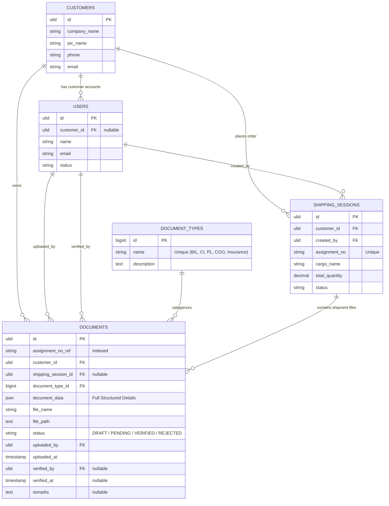
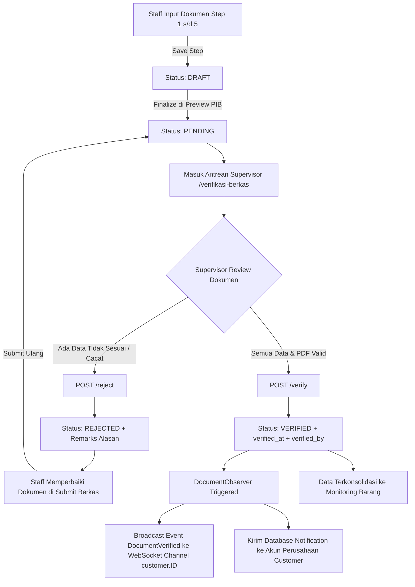

# 📑 Dokumentasi Komprehensif Sistem Verifikasi Berkas (GTD-MoveLog)

Dokumen ini memuat seluruh informasi teknis mengenai modul **Verifikasi Berkas**, meliputi daftar file terkait, skema tabel database, struktur data JSON payload, logika controller dan endpoint, hingga relasi antar tabel dan diagram siklus hidup berkas.

---

## 1. 📂 Daftar Seluruh File Terkait Verifikasi Berkas

### A. Backend (Controller, Service, Request, & Event)
| Kategori | Path File | Deskripsi |
| :--- | :--- | :--- |
| **Controller Utama** | `app/Http/Controllers/Web/VerifikasiBerkasController.php` | Mengelola antrean verifikasi berkas, inspeksi dokumen, validasi/approval/rejection supervisor, dan serve file PDF. |
| **Controller Terkait** | `app/Http/Controllers/Web/SubmitBerkasController.php` | Mengelola pengisian berkas bertahap (wizard), upload file PDF, dan finalisasi pengajuan berkas ke status *Pending Verification*. |
| **Service Layer** | `app/Services/DocumentSubmissionService.php` | Business logic penyimpanan berkas step-by-step, validasi kelengkapan 5 dokumen wajib, generate kode penugasan (`assignment_no_ref`). |
| **Service Pendukung** | `app/Services/MonitoringBarangService.php` | Mengonsolidasi data berkas yang terverifikasi untuk tracking pengiriman kargo. |
| **Service Pendukung** | `app/Services/GlobalSearchService.php` | Layanan pencarian global untuk menemukan berkas dan nomor dokumen di sistem. |
| **Form Request** | `app/Http/Requests/SaveDocumentStepRequest.php` | Validasi request payload dan parsing JSON string `document_data` sebelum disimpan. |
| **Event & Broadcast** | `app/Events/DocumentVerified.php` | Event realtime WebSocket yang di-broadcast ke channel private `customer.{customerId}` saat berkas disetujui. |
| **Notification** | `app/Notifications/DocumentVerifiedNotification.php` | Notifikasi database yang dikirimkan ke akun pengguna customer ketika berkas selesai diverifikasi. |
| **Observer** | `app/Observers/DocumentObserver.php` | Memantau perubahan status dokumen `status` (`VERIFIED`/`APPROVED`) untuk otomatis men-trigger Event & Notifikasi. |
| **Provider** | `app/Providers/AppServiceProvider.php` | Mendaftarkan observer `Document::observe(DocumentObserver::class)`. |
| **Routing** | `routes/web.php` | Definisi rute web & API Inertia untuk grup `verifikasi-berkas` dan `submit-berkas`. |

---

### B. Database (Migrations, Models, Enums, & Seeders)
| Kategori | Path File | Deskripsi |
| :--- | :--- | :--- |
| **Model Utama** | `app/Models/Document.php` | Eloquent Model untuk entitas dokumen berkas (`documents`). |
| **Model Tipe Dokumen** | `app/Models/DocumentType.php` | Eloquent Model jenis berkas kepabeanan/logistik (`document_types`). |
| **Model Relasi** | `app/Models/Customer.php` | Model data perusahaan pelanggan/pemilik barang (`customers`). |
| **Model Relasi** | `app/Models/User.php` | Model pengguna (staff uploader dan supervisor verifikator) (`users`). |
| **Model Relasi** | `app/Models/ShippingSession.php` | Model sesi penugasan pengiriman barang logistik (`shipping_sessions`). |
| **Enum Status** | `app/Enums/DocumentStatus.php` | Enum status berkas: `DRAFT`, `PENDING`, `VERIFIED`, `REJECTED`. |
| **Migration Dokumen** | `database/migrations/2026_07_13_190115_create_documents_table.php` | Skema tabel `documents`. |
| **Migration Tipe** | `database/migrations/2026_07_13_185958_create_document_types_table.php` | Skema tabel `document_types`. |
| **Seeder Tipe** | `database/seeders/DocumentTypeSeeder.php` | Master seeder 5 jenis berkas wajib logistik. |
| **Seeder Dokumen** | `database/seeders/DocumentSeeder.php` | Data dummy berkas invoice, B/L, packing list, insurance, COO. |

---

### C. Frontend (Inertia React Components & Utilities)
| Kategori | Path File | Deskripsi |
| :--- | :--- | :--- |
| **Halaman Antrean** | `resources/js/Pages/VerifikasiBerkas/Index.tsx` | Halaman antrean verifikasi pengiriman (daftar kontrak, filter status, summary card). |
| **Halaman Detail** | `resources/js/Pages/VerifikasiBerkas/Show.tsx` | Halaman verifikasi berkas per penugasan/kontrak (sidebar list dokumen, PDF viewer, actions verify/reject, tab metadata). |
| **Viewer Komponen** | `resources/js/Pages/VerifikasiBerkas/components/DocumentPreview.tsx` | Viewer dokumen (inline PDF reader via iframe atau rendered electronic form). |
| **Komparasi & Warning** | `resources/js/Pages/VerifikasiBerkas/components/MismatchWarnings.tsx` | Peringatan otomatis jika data Shipper/Consignee/Kapal tidak konsisten antar dokumen. |
| **Modal Aksi** | `resources/js/Pages/VerifikasiBerkas/components/DocumentStatusModal.tsx` | Modal konfirmasi verifikasi atau penolakan berkas dengan catatan revisi (*remarks*). |
| **Action Bar** | `resources/js/Pages/VerifikasiBerkas/components/DocumentActions.tsx` | Tombol aksi *Approve Document*, *Reject Document*, dan *Download PDF*. |
| **Metadata Viewer** | `resources/js/Pages/VerifikasiBerkas/components/DocumentMetadata.tsx` | Tab ringkasan data kargo, pihak shipper, consignee, notify party, dan transportasi. |
| **Helper & Logic** | `resources/js/Pages/VerifikasiBerkas/utils/shipmentUtils.ts` | Pengelompokan dokumen per shipment, ranking urgensi antrean, dan deteksi inkonsistensi field. |
| **TypeScript Types** | `resources/js/Pages/VerifikasiBerkas/types/index.ts` | Definisi tipe data TypeScript untuk modul Verifikasi Berkas. |

---

## 2. 🗄️ Struktur Tabel Database Terkait

### A. Tabel Utama: `documents`
Tabel inti yang menyimpan berkas fisik, nomor referensi penugasan, status approval, verifikator, dan data JSON terstruktur hasil ekstraksi formulir.

| Nama Kolom | Tipe Data | Nullable | Default | Relasi / Keterangan |
| :--- | :--- | :---: | :---: | :--- |
| `id` | `ULID` (char 26) | ❌ | Primary Key | ID unik dokumen berbasis waktu (*Universally Unique Lexicographically Sortable Identifier*). |
| `assignment_no_ref` | `VARCHAR(255)` | ❌ | - | Nomor referensi batch penugasan / nomor kontrak (contoh: `ASG-20260828-A1B2C3` atau `TRK-2024-001`). Indexed. |
| `customer_id` | `ULID` (char 26) | ❌ | - | Foreign Key ke `customers.id` (onUpdate: CASCADE, onDelete: RESTRICT). |
| `shipping_session_id` | `ULID` (char 26) | ✔️ | `NULL` | Foreign Key ke `shipping_sessions.id` (onUpdate: CASCADE, onDelete: CASCADE). |
| `document_type_id` | `BIGINT UNSIGNED` | ❌ | - | Foreign Key ke `document_types.id` (onUpdate: CASCADE, onDelete: RESTRICT). |
| `document_data` | `JSON` | ❌ | - | Menyimpan seluruh detail terstruktur berkas (entitas pihak, barang, rincian kapal, HS code, dll). |
| `file_name` | `VARCHAR(255)` | ❌ | - | Nama asli berkas PDF yang diunggah (contoh: `INV-2026-014_Commercial_Invoice.pdf`). |
| `file_path` | `TEXT` | ❌ | - | Lokasi path berkas fisik pada storage public (contoh: `documents/ASG-.../document.pdf`). |
| `status` | `VARCHAR(255)` | ❌ | `'PENDING'` | Status verifikasi: `DRAFT`, `PENDING`, `VERIFIED`, `REJECTED`. |
| `uploaded_by` | `ULID` (char 26) | ❌ | - | Foreign Key ke `users.id` (User yang mengunggah dokumen). |
| `uploaded_at` | `TIMESTAMP` | ❌ | `CURRENT_TIMESTAMP` | Waktu berkas diunggah. |
| `verified_by` | `ULID` (char 26) | ✔️ | `NULL` | Foreign Key ke `users.id` (Supervisor yang menyetujui atau menolak dokumen). |
| `verified_at` | `TIMESTAMP` | ✔️ | `NULL` | Waktu ketika dokumen diverifikasi/ditolak. |
| `remarks` | `TEXT` | ✔️ | `NULL` | Catatan supervisor (alasan penolakan dokumen jika ditolak, atau catatan approval). |
| `created_at` | `TIMESTAMP` | ✔️ | `NULL` | Waktu record dibuat. |
| `updated_at` | `TIMESTAMP` | ✔️ | `NULL` | Waktu record diperbarui. |

> **Constraint Khusus:**
> - `UNIQUE(assignment_no_ref, document_type_id)`: Menjamin dalam 1 batch penugasan hanya ada 1 record per jenis dokumen (mencegah duplikasi tipe dokumen pada penugasan yang sama).
> - `INDEX(shipping_session_id)` dan `INDEX(assignment_no_ref)`.

---

### B. Tabel Master: `document_types`
Menyimpan referensi 5 jenis dokumen kepabeanan/logistik wajib.

| Nama Kolom | Tipe Data | Nullable | Default | Keterangan |
| :--- | :--- | :---: | :---: | :--- |
| `id` | `BIGINT UNSIGNED` | ❌ | Auto Increment | Primary Key (1 sampai 5). |
| `name` | `VARCHAR(255)` | ❌ | - | Nama jenis dokumen (Unique). |
| `description` | `TEXT` | ✔️ | `NULL` | Penjelasan/deskripsi jenis dokumen. |
| `created_at` | `TIMESTAMP` | ✔️ | `NULL` | Timestamp pembuatan. |
| `updated_at` | `TIMESTAMP` | ✔️ | `NULL` | Timestamp pembaruan. |

---

### C. Tabel Pendukung Terkait Lainnya
1. **`customers`** (`id` ULID, `company_name`, `address`, `phone`, `email`, `pic_name`, timestamps).
2. **`users`** (`id` ULID, `customer_id` nullable, `name`, `email`, `password`, `status`, `phone`, `avatar`, timestamps).
3. **`shipping_sessions`** (`id` ULID, `customer_id`, `created_by`, `assignment_no`, `cargo_name`, `total_quantity`, `unit`, `origin`, `destination`, `current_checkpoint_id`, `status`, `notes`, timestamps).
4. **`notifications`** (`id` UUID, `type`, `notifiable_type`, `notifiable_id`, `data` JSON, `read_at`, timestamps).

---

## 3. 📦 Isi Tabel & Spesifikasi Data (Values & JSON Data Structure)

### A. Data Master Dokumen (`document_types`)
Sistem mewajibkan 5 tipe dokumen berikut sebelum berkas dapat difinalisasi:
1. `ID: 1` — **Bill of Lading** (B/L)
2. `ID: 2` — **Commercial Invoice** (CI)
3. `ID: 3` — **Packing List** (PL)
4. `ID: 4` — **Certificate of Origin** (COO)
5. `ID: 5` — **Insurance**

---

### B. Struktur Isi Kolom `document_data` (JSON Payload)

#### 1. Bill of Lading (`document_type_id = 1`)
```json
{
  "documentDetail": {
    "number": "BL-2026-008",
    "date": "2026-08-28",
    "shipmentContractNumber": "TRK-2024-001"
  },
  "shipper": {
    "name": "PT Heavy Equipment Indo",
    "address": "Jl. Industri Raya No. 45, Jakarta",
    "taxId": "01.234.567.8-012.000"
  },
  "consignee": {
    "name": "PT Customer A",
    "address": "Kawasan Industri Kariangau, Balikpapan",
    "taxId": "02.345.678.9-034.000"
  },
  "notifyParty": {
    "name": "PT Logistik Nusantara",
    "address": "Pelabuhan Semayang, Balikpapan",
    "taxId": "03.456.789.0-056.000"
  },
  "transportDetail": {
    "portOfLoading": "Tanjung Priok, Jakarta",
    "portOfDischarge": "Semayang, Balikpapan",
    "shippName": "KM Nusantara Jaya 08",
    "voyage": "V.2026-08"
  },
  "cargoDetail": [
    {
      "id": "item-1",
      "descriptionOfGoods": "Excavator CAT 320 GC",
      "hsCodePol": "8429.52.00",
      "grossWeight": "21000 KG",
      "packages": "1 Unit",
      "volume": "45 CBM"
    }
  ],
  "quantity": {
    "totalGrossWeight": "21000 KG",
    "totalPackages": "1 Unit",
    "totalVolume": "45 CBM"
  }
}
```

#### 2. Commercial Invoice (`document_type_id = 2`)
```json
{
  "documentDetail": {
    "number": "INV-2026-014",
    "date": "2026-08-27",
    "shipmentContractNumber": "TRK-2024-001"
  },
  "shipper": {
    "name": "PT Heavy Equipment Indo",
    "address": "Jl. Industri Raya No. 45, Jakarta",
    "taxId": "01.234.567.8-012.000"
  },
  "consignee": {
    "name": "PT Customer A",
    "address": "Kawasan Industri Kariangau, Balikpapan",
    "taxId": "02.345.678.9-034.000"
  },
  "termOfShipment": "FOB",
  "cargoDetail": [
    {
      "id": "cargo-1",
      "descriptionOfGoods": "Excavator CAT 320 GC",
      "quantityOfGoods": "1",
      "goodsUnitMeasurement": "Unit",
      "currency": "USD",
      "priceOfGoods": "145000",
      "totalAmount": "145000",
      "hsCodePol": "8429.52.00"
    }
  ],
  "totalAmount": "USD 145,000"
}
```

#### 3. Packing List (`document_type_id = 3`)
```json
{
  "documentDetail": {
    "number": "PL-2026-022",
    "date": "2026-08-27"
  },
  "documentReference": {
    "commercialInvoiceNumber": "INV-2026-014",
    "shipmentContractNumber": "TRK-2024-001"
  },
  "cargoDetail": [
    {
      "id": "pl-1",
      "descriptionOfGoods": "Excavator CAT 320 GC Main Body",
      "quantityPackage": "1",
      "packageUnit": "Unit",
      "netWeight": "20500 KG",
      "grossWeight": "21000 KG",
      "volumeDimension": "45 CBM"
    }
  ]
}
```

#### 4. Certificate of Origin (`document_type_id = 4`)
```json
{
  "documentDetail": {
    "number": "COO-2026-009",
    "issuedDate": "2026-08-28",
    "countryOfOrigin": "Indonesia"
  },
  "documentReference": {
    "commercialInvoiceNumber": "INV-2026-014",
    "billOfLadingNumber": "BL-2026-008"
  },
  "transportDetail": {
    "portOfLoading": "Tanjung Priok, Jakarta",
    "portOfDischarge": "Semayang, Balikpapan",
    "vesselName": "KM Nusantara Jaya 08"
  }
}
```

#### 5. Insurance (`document_type_id = 5`)
```json
{
  "documentDetail": {
    "policyNumber": "INS-2026-003",
    "insuranceCompany": "PT Asuransi Wahana Tata",
    "issuedDate": "2026-08-28"
  },
  "insurance": {
    "amountInsured": "USD 160,000",
    "coverageType": "Institute Cargo Clauses (A)",
    "currency": "USD"
  },
  "documentReference": {
    "shipmentContractNumber": "TRK-2024-001"
  }
}
```

---

## 4. 🎮 Controller & Endpoint Terkait

### A. `VerifikasiBerkasController` (Area Supervisor)
Semua route di controller ini dilindungi middleware `role:supervisor` dan method otorisasi internal `checkSupervisorAuthorization()`.

```
Supervisor User -> GET /verifikasi-berkas             (index: Antrean penugasan berkas)
Supervisor User -> GET /verifikasi-berkas/{contract}  (show: Viewer 5 dokumen & deteksi mismatch)
Supervisor User -> POST /verifikasi-berkas/{id}/verify (verify: Approve dokumen)
Supervisor User -> POST /verifikasi-berkas/{id}/reject (reject: Tolak dokumen + isi remarks)
Supervisor User -> GET /verifikasi-berkas/file/{id}   (serveFile: Stream PDF aman ke iframe)
```

| HTTP Method | Route / URL | Nama Route | Fungsi & Logika Bisnis |
| :--- | :--- | :--- | :--- |
| **GET** | `/verifikasi-berkas` | `verifikasi-berkas` | **Antrean Verifikasi:** Mengambil seluruh referensi penugasan yang statusnya non-draft (`PENDING`, `VERIFIED`, `REJECTED`), memuat relasi (`customer`, `documentType`, `uploadedBy`, `verifiedBy`), lalu merender komponen `VerifikasiBerkas/Index`. |
| **GET** | `/verifikasi-berkas/{contractNumber}` | `verifikasi-berkas.show` | **Inspeksi Berkas:** Mengambil 5 berkas dari `assignment_no_ref` atau JSON contract number, mentransformasi field untuk frontend React, dan merender `VerifikasiBerkas/Show`. |
| **POST** | `/verifikasi-berkas/{document}/verify` | `verifikasi-berkas.verify` | **Approval Dokumen:** Mengubah status `Document` menjadi `VERIFIED`, mencatat `verified_by = auth()->id()`, `verified_at = now()`, dan `remarks = $notes`. Men-trigger Observer untuk notifikasi & broadcast. |
| **POST** | `/verifikasi-berkas/{document}/reject` | `verifikasi-berkas.reject` | **Penolakan Dokumen:** Memvalidasi input `notes` (alasan penolakan), mengubah status `Document` menjadi `REJECTED`, mencatat `verified_by`, `verified_at`, dan `remarks`. |
| **GET** | `/verifikasi-berkas/file/{document}` | `verifikasi-berkas.file` | **Secure File Stream:** Memeriksa keberadaan berkas di `Storage::disk('public')` dan mengirimkan stream respons file biner (`application/pdf`) dengan *Content-Disposition: inline* untuk viewer PDF browser. |

---

### B. `SubmitBerkasController` (Area Input Dokumen)
Mengatur alur penginputan 5 dokumen step-by-step sebelum masuk ke antrean supervisor:

| HTTP Method | Route / URL | Nama Route | Fungsi |
| :--- | :--- | :--- | :--- |
| **GET** | `/submit-berkas` | `submit-berkas.index` | Menampilkan wizard submit berkas & ringkasan antrean submission penugasan. |
| **POST** | `/submit-berkas/start` | `submit-berkas.start` | Men-generate nomor referensi penugasan unik (`assignment_no_ref`). |
| **POST** | `/submit-berkas/step` | `submit-berkas.save-step` | Upsert satu jenis dokumen per step ke status `DRAFT` dan upload PDF fisik jika ada. |
| **POST** | `/submit-berkas/{ref}/finalize` | `submit-berkas.finalize` | Memvalidasi kelengkapan 5/5 dokumen wajib, lalu mengupdate semua status dokumen draft/rejected menjadi `PENDING` (siap diverifikasi supervisor). |

---

## 5. 🔗 Relasi Antar Tabel (Entity Relationships & Constraints)

### A. Diagram Relasi (Mermaid ERD)



---

### B. Definisi Relasi pada Eloquent Models

#### 1. Model `Document`
- `customer()` ➔ `BelongsTo(Customer::class)`
- `shippingSession()` ➔ `BelongsTo(ShippingSession::class, 'shipping_session_id')`
- `documentType()` ➔ `BelongsTo(DocumentType::class, 'document_type_id')`
- `uploadedBy()` ➔ `BelongsTo(User::class, 'uploaded_by')`
- `verifiedBy()` ➔ `BelongsTo(User::class, 'verified_by')`

#### 2. Model `DocumentType`
- `documents()` ➔ `HasMany(Document::class)`

#### 3. Model `Customer`
- `shippingSessions()` ➔ `HasMany(ShippingSession::class)`
- `users()` ➔ `HasMany(User::class, 'customer_id')`

#### 4. Model `User`
- `uploadedDocuments()` ➔ `HasMany(Document::class, 'uploaded_by')`
- `verifiedDocuments()` ➔ `HasMany(Document::class, 'verified_by')`
- `shippingSessions()` ➔ `HasMany(ShippingSession::class, 'created_by')`
- `customer()` ➔ `BelongsTo(Customer::class, 'customer_id')`

#### 5. Model `ShippingSession`
- `documents()` ➔ `HasMany(Document::class)`
- `customer()` ➔ `BelongsTo(Customer::class)`
- `createdBy()` ➔ `BelongsTo(User::class, 'created_by')`

---

## 6. 🔄 Siklus Hidup Dokumen & Alur Notifikasi (*Lifecycle*)


