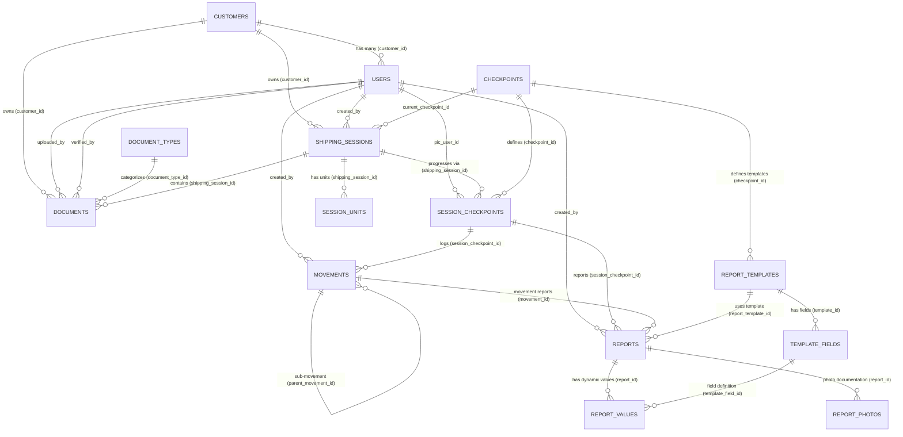

# Customer Data Ownership & Access Audit: GTD-MoveLog

**Tanggal Audit:** 1 September 2026  
**Aplikasi:** GTD-MoveLog (Laravel 12 + Inertia.js + React + PostgreSQL)  
**Tujuan:** Audit menyeluruh isolasi data multi-tenant tingkat Customer (PT/Perusahaan), mitigasi IDOR (Insecure Direct Object Reference), dan validasi hak akses data.

---

## 1. Executive Summary

Berdasarkan audit mendalam terhadap seluruh lapisan codebase GTD-MoveLog (Database Migration, Eloquent Models, Controllers, Services, Policies, Observers, Events, Notifications, Routes, dan Frontend React/Inertia), berikut adalah ringkasan eksekutif mengenai isolasi data Customer:

### Kondisi Positif (Sudah Terisolasi dengan Baik)
1. **Schema Fondasi Sesuai ERD:** Database telah memiliki kolom `customer_id` (ULID) pada tabel `users`, `shipping_sessions`, dan `documents`. Hubungan `Customer` 1:N `User` dan `Customer` 1:N `ShippingSession` sudah terdefinisi dengan Foreign Key constraint yang valid.
2. **Customer Dashboard & Monitoring Query Scoping:** Controller khusus customer (`CustomerDashboardController`) telah menerapkan filter query eksplisit berdasarkan `$customer->id` untuk seluruh metrik, daftar pengiriman (`monitoring`), timeline checkpoint (`checkpoints`), dan detail shipment (`detail`).
3. **ShippingSessionPolicy Active:** Pemeriksaan kepemilikan data (`ShippingSessionPolicy@view`) aktif melindungi endpoint `/customer/shipment/{id}` dan `/customer/monitoring-barang/{id}` sehingga akses langsung ID shipment milik PT lain mengembalikan status **403 Forbidden**.
4. **Notifikasi & Realtime WebSocket Terisolasi:** Notifikasi database dan broadcast event via WebSocket (`PrivateChannel('customer.{customerId}')`) telah terikat ke `customer_id`, sehingga seluruh user dalam satu PT menerima notifikasi yang sama, sedangkan user PT lain tidak menerima event tersebut.

### Temuan Kritis & Celah Keamanan (Security Gaps)
1. **[CRITICAL] Pendaftaran Akun (`RegisteredUserController`) Memecah Relasi PT:**
   Alur registrasi customer saat ini menggunakan email pribadi user untuk membuat entitas `Customer` baru (`Customer::firstOrCreate(['email' => $request->email], ['company_name' => $request->name])`). Akibatnya, dua user dari PT yang sama (misal `user1@pt-a.com` dan `user2@pt-a.com`) akan didaftarkan sebagai **dua Customer (PT) yang berbeda**, sehingga User 2 tidak akan pernah bisa melihat shipment yang dibuat untuk PT A.
2. **[CRITICAL] Route Internal Tanpa Role Middleware Terbuka untuk Customer:**
   Pada file `routes/web.php`, route internal seperti `/monitoring-barang`, `/monitoring-checkpoint`, `/submit-berkas`, dan `/users` diletakkan di luar middleware `role:super-admin|staff|supervisor`. User dengan role `customer` dapat mengakses URL internal ini secara langsung dan melihat **seluruh data kargo, dokumen, dan checkpoint milik seluruh PT di sistem**.
3. **[HIGH] IDOR pada `MonitoringCheckpointController`:**
   Endpoint `/monitoring-checkpoint/{assignmentNo}` mengambil data shipment dan seluruh riwayat checkpoint berdasarkan parameter URL tanpa memeriksa role atau kepemilikan `customer_id`.
4. **[MEDIUM] URL Redirect pada Global Search:**
   `GlobalSearchService` berhasil memfilter query kargo dan dokumen untuk customer, namun metadata `url` yang dikembalikan merujuk ke rute internal (`/monitoring-barang`, `/submit-dokumen`, `/monitoring-cp`) dan bukan rute customer (`/customer/monitoring-barang/{id}`, `/customer/checkpoints`).
5. **[MEDIUM] Fallback Pembuatan Customer Otomatis pada `CustomerDashboardController`:**
   Jika user role `customer` belum memiliki `customer_id`, controller secara otomatis membuat entitas `Customer` dummy berdasarkan nama user alih-alih melempar error 403. Hal ini menyebabkan pengujian `test_customer_with_no_customer_id_is_blocked_not_fallback` gagal (mengembalikan 200, bukan 403).

---

## 2. Current Database Structure

Seluruh entitas shipment dan customer diimplementasikan menggunakan PostgreSQL dengan tipe Primary Key **ULID (26 karakter)** untuk tabel transaksi dan **BigInteger Auto-increment** untuk tabel master/lookup.

### 2.1. Tabel-Tabel Terkait

| Tabel | Tipe PK | Kolom Utama Terkait Ownership | Foreign Key Constraint |
|---|---|---|---|
| `customers` | ULID | `id`, `company_name`, `email`, `pic_name` | - |
| `users` | ULID | `id`, `customer_id`, `name`, `email`, `status` | `customer_id` -> `customers.id` (NULL ON DELETE) |
| `shipping_sessions` | ULID | `id`, `customer_id`, `created_by`, `assignment_no`, `current_checkpoint_id` | `customer_id` -> `customers.id` (RESTRICT ON DELETE)<br>`created_by` -> `users.id`<br>`current_checkpoint_id` -> `checkpoints.id` |
| `documents` | ULID | `id`, `customer_id`, `shipping_session_id`, `assignment_no_ref`, `document_type_id`, `uploaded_by`, `verified_by` | `customer_id` -> `customers.id`<br>`shipping_session_id` -> `shipping_sessions.id`<br>`document_type_id` -> `document_types.id`<br>`uploaded_by` -> `users.id`<br>`verified_by` -> `users.id` |
| `session_units` | ULID | `id`, `shipping_session_id`, `unit_name`, `quantity` | `shipping_session_id` -> `shipping_sessions.id` (CASCADE ON DELETE) |
| `session_checkpoints` | ULID | `id`, `shipping_session_id`, `checkpoint_id`, `pic_user_id`, `status` | `shipping_session_id` -> `shipping_sessions.id` (CASCADE ON DELETE)<br>`checkpoint_id` -> `checkpoints.id`<br>`pic_user_id` -> `users.id` |
| `checkpoints` | BigInt | `id`, `name`, `sequence` | - (Master Data) |
| `document_types` | BigInt | `id`, `name` | - (Master Data) |
| `movements` | ULID | `id`, `session_checkpoint_id`, `parent_movement_id`, `created_by` | `session_checkpoint_id` -> `session_checkpoints.id`<br>`parent_movement_id` -> `movements.id`<br>`created_by` -> `users.id` |
| `reports` | ULID | `id`, `session_checkpoint_id`, `movement_id`, `report_template_id`, `created_by` | `session_checkpoint_id` -> `session_checkpoints.id`<br>`movement_id` -> `movements.id`<br>`report_template_id` -> `report_templates.id`<br>`created_by` -> `users.id` |
| `report_values` | BigInt | `id`, `report_id`, `template_field_id`, `value` | `report_id` -> `reports.id`<br>`template_field_id` -> `template_fields.id` |
| `report_photos` | ULID | `id`, `report_id`, `photo_url` | `report_id` -> `reports.id` |
| `notifications` | UUID | `id`, `notifiable_type`, `notifiable_id`, `data` | Index (`notifiable_type`, `notifiable_id`) |

---

## 3. Customer / User Relationship

### 3.1. Cara Role Customer Disimpan
Role disimpan menggunakan package **Spatie Laravel Permission**.
- Model `User` menggunakan trait `HasRoles`.
- Nama role tersimpan di tabel `roles` dengan `name = 'customer'` dan `guard_name = 'web'`.
- Enum referensi: `App\Enums\UserRole::Customer` (`'customer'`).

### 3.2. Cara User Terhubung ke PT/Customer
- Tabel `users` memiliki kolom `customer_id` (foreign key ke `customers.id`).
- Model `User` memiliki relasi:
  ```php
  public function customer(): BelongsTo
  {
      return $this->belongsTo(Customer::class, 'customer_id');
  }
  ```
- Model `Customer` memiliki relasi balik:
  ```php
  public function users(): HasMany
  {
      return $this->hasMany(User::class, 'customer_id');
  }
  ```

### 3.3. Kardinalitas Hubungan
- **1 PT / Customer : N User** (Satu perusahaan dapat memiliki banyak akun perwakilan user).
- **1 User : 1 PT / Customer** (Satu user hanya terafiliasi ke 1 PT melalui `users.customer_id`).
- Untuk user staf internal (`super-admin`, `supervisor`, `staff`, `field-worker`), nilai `users.customer_id` bernilai `NULL`.

### 3.4. Analisis Alur Registrasi Aktual & Celah Keamanan Identitas PT
Pada `RegisteredUserController@store`:
```php
$customer = Customer::firstOrCreate(
    ['email' => $request->email],
    [
        'company_name' => $request->name,
        'pic_name'     => $request->name,
        'email'        => $request->email,
    ]
);

$user = User::create([
    'customer_id' => $customer->id,
    'name'        => $request->name,
    'email'       => $request->email,
    'password'    => Hash::make($request->password),
]);
```

**Temuan Kritis Pada Alur Ini:**
1. **Penciptaan Customer Duplikat (Broken Multi-user per Company):** Pencarian `firstOrCreate` dilakukan berdasarkan `email` pribadi pendaftar. Jika User A1 (`budi@perusahaan-a.com`) dan User A2 (`siti@perusahaan-a.com`) mendaftar, sistem menciptakan dua row Customer berbeda (`company_name: 'Budi'` dan `company_name: 'Siti'`).
2. **Nama Perusahaan Keliru:** Kolom `company_name` diisi dengan `$request->name` (nama individu user), bukan nama legal PT/perusahaan.
3. **Source of Truth Identitas PT:** Source of truth di database adalah tabel `customers`. Namun karena registrasi publik tidak menyediakan pemilihan perusahaan / kode perusahaan / persetujuan admin, isolasi antar user dalam satu PT menjadi terfragmentasi.

---

## 4. Shipping Session Relationship

### 4.1. Cara ShippingSession Terhubung ke Customer & User
- **Kepemilikan Customer:** `shipping_sessions.customer_id` (FK ke `customers.id`).
- **Pembuat Sesi (Operator/Staff):** `shipping_sessions.created_by` (FK ke `users.id`).

### 4.2. Logika Penentuan Kepemilikan Kargo saat User Login
Jika User A1 (dari PT A) login:
```text
Auth::user()
   ↓
Auth::user()->customer_id  (misal: '01J6CUST00000000000000000A')
   ↓
ShippingSession::where('customer_id', Auth::user()->customer_id)
```
Sistem mengetahui bahwa sesi kargo adalah milik PT A melalui pencocokan nilai `shipping_sessions.customer_id == auth()->user()->customer_id`.

---

## 5. Document / Submit Berkas Relationship

### 5.1. Alur Pembuatan Dokumen & Keterkaitan
1. **Unggah Berkas:** Berkas diunggah melalui wizard `SubmitBerkasController` atau disuntikkan via seeder.
2. **Keterkaitan Dokumen:**
   - Tabel `documents` memiliki `customer_id` (FK langsung ke `customers.id`),
   - Memiliki `assignment_no_ref` (string penanda grup pengiriman, contoh: `ASG-20260901-ABCDEF`),
   - Memiliki `shipping_session_id` (nullable FK).
3. **Status Dokumen:** `DRAFT` → `PENDING` (saat finalisasi) → `VERIFIED` / `REJECTED` (oleh Supervisor).
4. **Pembuatan Shipping Session Otomatis:**
   Ketika kelima dokumen wajib (`Bill of Lading`, `Commercial Invoice`, `Packing List`, `Certificate of Origin`, `Insurance`) berstatus `VERIFIED`, `VerifikasiBerkasController::maybeGenerateShippingSession()` secara otomatis membuat record baru di `shipping_sessions` dan mengisi `documents.shipping_session_id`.

### 5.2. Akses Dokumen oleh Customer
Pada halaman detail kargo customer (`CustomerDashboardController@detail`), dokumen ditampilkan kepada customer dengan aturan ketat:
```php
$verifiedDocs = $session->documents->filter(function ($doc) {
    return in_array(strtoupper((string) $doc->status), ['VERIFIED', 'APPROVED'], true);
});
```
Customer **hanya dapat melihat dokumen yang telah disetujui/diverifikasi** oleh Supervisor. Dokumen berstatus `DRAFT`, `PENDING`, atau `REJECTED` disembunyikan dari portal customer.

### 5.3. Evaluasi Terhadap Requirement Bisnis Verifikasi Berkas
- **Upload PDF & Data JSON:** Didukung penuh (`documents.file_path` dan `documents.document_data` JSONB).
- **Perbandingan Nilai Antar Dokumen:** Validasi kelengkapan 5 dokumen wajib sudah ada. Namun logika validasi rekonsiliasi nilai (seperti pencocokan nilai tonase antara CI dan BL) saat ini masih berjalan di sisi frontend UI Preview PIB dan belum diperiksa via backend service validator.

---

## 6. Checkpoint Relationship

### 6.1. Struktur Relasi Checkpoint
- `checkpoints`: Master data 4 pos logistik (`Kapal`, `Tongkang`, `Pelabuhan`, `Site`) dengan urutan `sequence` (1 s/d 4).
- `session_checkpoints`: Pos checkpoint spesifik untuk 1 sesi kargo (`shipping_session_id`, `checkpoint_id`, `pic_user_id`, `status`, `actual_start`, `actual_finish`).
- `shipping_sessions.current_checkpoint_id`: Pos checkpoint aktif kargo saat ini.

### 6.2. Jalur Penelusuran Checkpoint ke Customer
```text
SessionCheckpoint
       ↓ (shipping_session_id)
ShippingSession
       ↓ (customer_id)
Customer
```
Customer PT A tidak dapat melihat checkpoint shipment PT B karena query pada `CustomerDashboardController@checkpoints` dan `detail` difilter berdasarkan `where('customer_id', $customer->id)` dan diotorisasi melalui `ShippingSessionPolicy`.

---

## 7. Movement & Report Relationship

### 7.1. Struktur Relasi Movement & Laporan Lapangan
- `movements`: Pencatatan aktivitas fisik kargo (hauling, loading, unloading).
  - Terhubung ke `session_checkpoints` melalui `movements.session_checkpoint_id`.
  - Mendukung hirarki sub-movement melalui `movements.parent_movement_id`.
- `reports`: Laporan kejadian kargo dan pengisian formulir lapangan.
  - Terhubung ke `session_checkpoints` (`session_checkpoint_id`) atau `movements` (`movement_id`).
  - Nilai field dinamis tersimpan di `report_values` (`report_id`, `template_field_id`, `value`).
  - Foto dokumentasi tersimpan di `report_photos` (`report_id`, `photo_url`, `is_cover`).

### 7.2. Jalur Kepemilikan Data Lapangan ke Customer
```text
Report / Movement
       ↓
SessionCheckpoint
       ↓
ShippingSession
       ↓
Customer
```
Semua laporan dan foto lapangan diikat ke `session_checkpoint_id`, yang secara langsung bermuara pada `shipping_sessions.customer_id`.

---

## 8. Customer Page Data Sources

| Halaman Frontend | Controller & Method | Tabel Database yang Diakses | Mekanisme Filter Customer | Potensi Kebocoran Data PT Lain |
|---|---|---|---|---|
| **Dashboard** (`Customer/Dashboard.tsx`) | `CustomerDashboardController@index` | `customers`, `shipping_sessions`, `checkpoints`, `session_checkpoints`, `session_units` | `where('customer_id', $customer->id)` pada semua query statistik dan shipment list. | **Aman.** Data terisolasi sesuai `$customer->id`. |
| **Monitoring Barang** (`Customer/MonitoringBarang.tsx`) | `CustomerDashboardController@monitoring` | `shipping_sessions`, `checkpoints`, `session_units` | `where('customer_id', $customer->id)` dengan filter pencarian dan status. | **Aman.** Data terisolasi. |
| **Detail Shipment** (`Customer/DetailShipment.tsx`) | `CustomerDashboardController@detail` | `shipping_sessions`, `session_checkpoints`, `checkpoints`, `documents`, `document_types`, `session_units`, `users` | `$this->authorize('view', $session)` via `ShippingSessionPolicy`. Hanya menampilkan dokumen `VERIFIED`. | **Aman.** Akses IDOR dicegah dengan HTTP 403. |
| **Checkpoint Overview** (`Customer/Checkpoint.tsx`) | `CustomerDashboardController@checkpoints` | `checkpoints`, `shipping_sessions` | Relasi `shippingSessions` di-filter: `fn($q) => $q->where('customer_id', $customer->id)`. | **Aman.** Data terisolasi. |
| **Notifikasi** (`CustomerLayout.tsx`) | `Customer\NotificationController@index` | `notifications` | `$user->notifications()` milik user yang sedang terautentikasi. | **Aman.** Terisolasi per user. |
| **Edit Profil** (`Customer/EditProfile.tsx`) | `Customer\ProfileController@edit`, `update` | `users`, `customers` | Mengubah data akun user yang sedang login (`$request->user()`). | **Aman.** Terisolasi. |
| **Global Search** (`Components/GlobalSearchBar.tsx`) | `GlobalSearchController@quick`, `index` | `shipping_sessions`, `documents`, `checkpoints` | `where('customer_id', $customer->id)` dan `whereHas('shippingSession', ...)`. | **Aman pada query data**, namun URL link menuju rute internal. |

---

## 9. Notification Data Flow

### 9.1. Alur Pembuatan dan Pengiriman Notifikasi
Notifikasi sistem di-trigger secara otomatis melalui Model Observers ketika terjadi perubahan data:

```text
[Aksi Operasional / Verifikasi]
       ↓
Model Observer Triggered:
  • DocumentObserver (Status: VERIFIED)
  • SessionCheckpointObserver (Status: IN_PROGRESS / COMPLETED)
  • ShippingSessionObserver (Status: DELIVERED)
       ↓
Ambil seluruh user PT terkait:
  $users = $session->customer->users;
       ↓
Kirim Database Notification:
  Notification::send($users, new ShipmentStageUpdated(...));
       ↓
Kirim Real-time WebSocket Broadcast:
  broadcast(new CheckpointProgressUpdated(..., customerId));
       ↓
Private Channel WebSocket:
  customer.{customerId} (Hanya user PT A yang terautentikasi dapat listen)
```

### 9.2. Evaluasi Skenario Notifikasi
- **Skenario:** Pengiriman PT A berganti status ke pos Pelabuhan.
  - User A1 (PT A) → Menerima notifikasi database + real-time toast.
  - User A2 (PT A) → Menerima notifikasi database + real-time toast.
  - User B1 (PT B) → **Tidak menerima notifikasi apapun** (channel WebSocket di-protect oleh `routes/channels.php` dan database query scoped ke `$user->notifications()`).

---

## 10. Global Search Data Flow

### 10.1. Mekanisme Scoping pada Global Search
Ketika user dengan role `customer` melakukan pencarian:
1. `GlobalSearchService::canAccessCategory`:
   - Kategori `users` (Kelola Akun) → **Dilarang** untuk customer.
   - Kategori `sesi` (Sesi Pekerja Internal) → **Dilarang** untuk customer.
   - Kategori `barang`, `dokumen`, `checkpoint` → **Diizinkan**.
2. **Scoping Kargo (`searchBarang`):**
   ```php
   if ($user->hasRole(UserRole::Customer->value)) {
       $customer = $user->customer;
       if (!$customer) return [];
       $query->where('customer_id', $customer->id);
   }
   ```
3. **Scoping Dokumen (`searchDokumen`):**
   ```php
   if ($user->hasRole(UserRole::Customer->value)) {
       $customer = $user->customer;
       if (!$customer) return [];
       $query->whereHas('shippingSession', function ($sq) use ($customer) {
           $sq->where('customer_id', $customer->id);
       });
   }
   ```
4. **Scoping Checkpoint (`searchCheckpoint`):**
   Eager loading `shippingSessions` dibatasi hanya untuk `$customer->id`.

### 10.2. Masalah Ditemukan pada Global Search
Meskipun hasil query sudah bersih dari data PT lain, properti `url` pada payload JSON hasil search merujuk ke endpoint internal staf:
- Item Kargo → mengembalikan URL `"/monitoring-barang"` (harus diubah menjadi `"/customer/monitoring-barang/{id}"`).
- Item Dokumen → mengembalikan URL `"/submit-dokumen"` (harus diubah menjadi `"/customer/monitoring-barang/{shipping_session_id}"`).
- Item Checkpoint → mengembalikan URL `"/monitoring-cp"` (harus diubah menjadi `"/customer/checkpoints"`).

---

## 11. Authorization & Policy Audit

### 11.1. Evaluasi `ShippingSessionPolicy`
Implementasi saat ini pada `app/Policies/ShippingSessionPolicy.php`:
```php
public function view(User $user, ShippingSession $session): bool
{
    if ($user->hasRole(UserRole::Customer->value) || $user->hasRole('customer')) {
        return $user->customer !== null && (string) $session->customer_id === (string) $user->customer->id;
    }

    return true;
}
```
- **Kelebihan:** Sangat efektif mencegah IDOR di controller customer.
- **Kekurangan:** Belum mendefinisikan method `update`, `delete`, atau `viewAny` dengan kontrol granular.

### 11.2. Evaluasi `UserPolicy`
File `app/Policies/UserPolicy.php` merujuk ke Enum `UserRole::Admin` dan `UserRole::Manager` yang tidak ada di `app/Enums/UserRole.php`. Ini merupakan bug inkonsistensi yang perlu dirapikan.

### 11.3. Celah Otorisasi Route Web (`routes/web.php`)
Di dalam `routes/web.php`:
```php
Route::middleware(['auth', 'verified'])->group(function () {
    // Rute Internal yang TIDAK dilindungi middleware role:
    Route::get('monitoring-barang', [MonitoringBarangController::class, 'index']);
    Route::get('laporan', [LaporanController::class, 'index']);
    Route::prefix('submit-berkas')->group(...);
    Route::prefix('monitoring-checkpoint')->group(...);
    Route::resource('users', UserController::class);
});
```
**Dampak:** User yang login sebagai `Customer` dapat mengetik URL `http://domain/monitoring-barang` atau `http://domain/monitoring-checkpoint` di address bar browser dan langsung disajikan data seluruh shipment internal GTD dari berbagai perusahaan!

---

## 12. IDOR / Cross-Company Access Analysis

| Endpoint / Parameter | Skenario Pengujian | Hasil Aktual Saat Ini | Tingkat Risiko | Rekomendasi Perbaikan |
|---|---|---|---|---|
| `GET /customer/shipment/{id}` | User PT A membuka UUID shipment milik PT B | **403 Forbidden** (Lolos Uji) | Aman | Pertahankan policy check. |
| `GET /customer/monitoring-barang/{id}` | User PT A membuka UUID shipment milik PT B | **403 Forbidden** (Lolos Uji) | Aman | Pertahankan policy check. |
| `POST /customer/notifications/{id}/read` | User PT A mencoba menandai notifikasi milik User PT B | **404 Not Found** (Lolos Uji) | Aman | Pertahankan query scoping. |
| `GET /monitoring-checkpoint/{assignmentNo}` | User PT A membuka kode penugasan kargo milik PT B | **200 OK (Data PT B Bocor)** | **CRITICAL** | Pasang middleware `role:super-admin|staff|supervisor` atau terapkan Policy. |
| `GET /monitoring-barang` | User PT A membuka daftar pemantauan staf internal | **200 OK (Seluruh Data PT Bocor)** | **CRITICAL** | Pasang middleware `role:super-admin|staff|supervisor`. |
| `GET /submit-berkas/{assignmentNoRef}` | User PT A membuka dokumen berkas penugasan PT B | **200 OK (Dokumen PT B Bocor)** | **CRITICAL** | Pasang middleware `role:super-admin|staff`. |
| `GET /submit-berkas/{assignmentNoRef}/status` | User PT A membuka status submission berkas PT B | **200 OK (Status PT B Bocor)** | **HIGH** | Pasang middleware `role:super-admin|staff`. |
| `GET /verifikasi-berkas/file/{document}` | User PT A mencoba unduh PDF via direct URL verifikasi | **403 Forbidden** (Lolos Uji) | Aman | Di-protect method `checkSupervisorAuthorization`. |

---

## 13. Database Relationship Diagram

Diagram Mermaid berikut mencerminkan relasi aktual dari database migration dan model Eloquent:



---

## 14. Customer Data Flow

Berikut adalah alur data dari login hingga penampilan data di layar Customer:

```text
1. LOGIN & AUTENTIKASI
   User memasukkan email & password
   ↓ (AuthenticatedSessionController@store)
   Cek UserStatus == Active
   ↓
   Spatie Role Check: User memiliki role 'customer'
   ↓
   Redirect ke route('customer.dashboard')

2. RESOLUSI IDENTITAS PT / CUSTOMER
   CustomerDashboardController memanggil $user->customer
   ↓
   Ambil customer_id dari kolom users.customer_id
   ↓
   Objek Customer (PT A) teridentifikasi (ID: 01J6...)

3. QUERY & ISOLASI DATA PORTAL
   ┌─────────────────────────────────────────────────────────────┐
   │ Query Data:                                                 │
   │ • ShippingSession::where('customer_id', $customer->id)      │
   │ • Checkpoint::with(['shippingSessions' => where(customer_id)│
   │ • Document::where('customer_id', $customer->id)             │
   │            ->whereIn('status', ['VERIFIED', 'APPROVED'])    │
   └─────────────────────────────────────────────────────────────┘
   ↓
4. SERVING INERTIA PROPS
   Props dikirim ke React via Inertia::render('Customer/...')
   ↓
5. TAMPILAN FRONTEND (REACT / TYPESCRIPT)
   Dashboard / MonitoringBarang / DetailShipment / Checkpoints
   (Hanya data milik PT A yang dirender di layar user)
```

---

## 15. Data Ownership Matrix

| Entitas | Tabel | Primary Key | Pemilik Customer | Jalur Penelusuran Kepemilikan (Ownership Path) | Akses Customer | Potensi Risiko |
|---|---|---|---|---|---|---|
| **Customer** | `customers` | `id` (ULID) | Self | `customers.id` | Read (Hanya profil sendiri) | Rendah |
| **User** | `users` | `id` (ULID) | `customer_id` | `users.customer_id -> customers.id` | Read/Update (Hanya akun sendiri) | Pendaftaran akun baru membuat PT terpisah |
| **Shipping Session** | `shipping_sessions` | `id` (ULID) | `customer_id` | `shipping_sessions.customer_id -> customers.id` | Read (List & Detail milik PT sendiri) | Celah IDOR pada rute internal non-customer |
| **Session Unit** | `session_units` | `id` (ULID) | Relasional | `session_units.shipping_session_id -> shipping_sessions.customer_id` | Read (Sebagai nested props shipment) | Aman |
| **Document** | `documents` | `id` (ULID) | `customer_id` | `documents.customer_id -> customers.id` | Read (Hanya status `VERIFIED`) | Celah IDOR pada submit-berkas show |
| **Document Type** | `document_types` | `id` (BigInt) | Publik / Master | Master data global | Read Only | Aman |
| **Session Checkpoint**| `session_checkpoints` | `id` (ULID) | Relasional | `session_checkpoints.shipping_session_id -> shipping_sessions.customer_id` | Read (Timeline kargo) | Celah IDOR pada rute monitoring-checkpoint |
| **Checkpoint** | `checkpoints` | `id` (BigInt) | Master | Master data tahapan kargo | Read Only | Aman |
| **Movement** | `movements` | `id` (ULID) | Relasional | `movements.session_checkpoint_id -> session_checkpoints -> shipping_sessions.customer_id` | Belum ditampilkan ke Customer | Aman |
| **Report** | `reports` | `id` (ULID) | Relasional | `reports.session_checkpoint_id -> session_checkpoints -> shipping_sessions.customer_id` | Read (Laporan status) | Aman |
| **Report Value** | `report_values` | `id` (BigInt) | Relasional | `report_values.report_id -> reports -> session_checkpoints -> customer` | Read | Aman |
| **Report Photo** | `report_photos` | `id` (ULID) | Relasional | `report_photos.report_id -> reports -> session_checkpoints -> customer` | Read (Foto dokumentasi) | Aman |
| **Notification** | `notifications` | `id` (UUID) | `notifiable_id` | `notifications.notifiable_id -> users.id (dimana users.customer_id = PT)` | Read & Mark Read | Aman |

---

## 16. Customer Page Matrix

| Halaman | Backend Controller | Service Terkait | Tabel yang Digunakan | Filter Customer di Backend | Otorisasi / Policy | Tingkat Risiko |
|---|---|---|---|---|---|---|
| **Customer Dashboard** | `CustomerDashboardController@index` | - | `customers`, `shipping_sessions`, `checkpoints` | `where('customer_id', $customer->id)` | Role `customer` | Rendah |
| **Monitoring Barang (Customer)** | `CustomerDashboardController@monitoring` | - | `shipping_sessions`, `checkpoints`, `session_units` | `where('customer_id', $customer->id)` | Role `customer` | Rendah |
| **Detail Shipment (Customer)** | `CustomerDashboardController@detail` | - | `shipping_sessions`, `session_checkpoints`, `documents`, `session_units` | Relasi eager loaded pada model shipment | `ShippingSessionPolicy@view` | Rendah |
| **Checkpoint (Customer)** | `CustomerDashboardController@checkpoints` | - | `checkpoints`, `shipping_sessions` | `where('customer_id', $customer->id)` | Role `customer` | Rendah |
| **Notifikasi (Customer)** | `Customer\NotificationController` | - | `notifications` | `$user->notifications()` | Auth user | Rendah |
| **Edit Profil (Customer)** | `Customer\ProfileController` | - | `users`, `customers` | `$request->user()` | Auth user | Rendah |
| **Global Search** | `GlobalSearchController` | `GlobalSearchService` | `shipping_sessions`, `documents`, `checkpoints` | `where('customer_id', $customer->id)` | `canAccessCategory` | Sedang (URL redirect salah) |
| **Monitoring Barang (Internal)** | `MonitoringBarangController` | `MonitoringBarangService` | `documents`, `customers` | **TIDAK ADA FILTER CUSTOMER** | **TIDAK ADA ROLE CHECK** | **CRITICAL** (Customer dapat akses) |
| **Monitoring Checkpoint (Internal)**| `MonitoringCheckpointController`| `SessionCheckpointService` | `shipping_sessions`, `session_checkpoints` | **TIDAK ADA FILTER CUSTOMER** | **TIDAK ADA ROLE CHECK** | **CRITICAL** (Customer dapat akses) |
| **Submit Berkas (Internal)** | `SubmitBerkasController` | `DocumentSubmissionService` | `documents`, `customers` | **TIDAK ADA FILTER CUSTOMER** | **TIDAK ADA ROLE CHECK** | **CRITICAL** (Customer dapat akses) |

---

## 17. Security Gaps

### Kategori Temuan Keamanan

#### [CRITICAL] 1. Route Internal Tidak Memiliki Role Middleware Guard
- **Lokasi:** `routes/web.php`
- **Deskripsi:** Route internal operasional seperti `/monitoring-barang`, `/monitoring-checkpoint`, `/submit-berkas`, dan `/users` ditempatkan langsung di bawah middleware `auth`, tanpa batasan role Spatie (`role:super-admin|staff|supervisor`).
- **Dampak:** Pengguna dengan role `customer` dapat mengakses halaman-halaman tersebut secara langsung via URL browser dan melihat seluruh data transaksi dari seluruh perusahaan klien lain.

#### [CRITICAL] 2. Fragmentasi Akun Perusahaan pada Alur Pendaftaran
- **Lokasi:** `app/Http/Controllers/Web/Auth/RegisteredUserController.php`
- **Deskripsi:** Registrasi mandiri membuat record `Customer` baru per alamat email user. Dua staf dari PT yang sama yang mendaftar secara mandiri tidak akan terhubung ke entitas PT yang sama.
- **Dampak:** Kegagalan arsitektur multi-user per company (User A2 tidak dapat melihat data pengiriman PT A).

#### [HIGH] 3. IDOR pada Modul Internal Monitoring Checkpoint & Submit Berkas
- **Lokasi:** `app/Http/Controllers/Web/MonitoringCheckpointController.php`, `app/Http/Controllers/Web/SubmitBerkasController.php`
- **Deskripsi:** Method `show($assignmentNo)` dan `show($assignmentNoRef)` mengambil record tanpa memeriksa apakah pengguna yang meminta adalah staf berwenang atau customer pemilik data.
- **Dampak:** Parameter ID transaksi dapat di-enumerasi untuk membaca data dokumen dan pergerakan kargo milik pihak lain.

#### [MEDIUM] 4. URL Metadata pada Global Search Mengarah ke Rute Internal
- **Lokasi:** `app/Services/GlobalSearchService.php`
- **Deskripsi:** Query pencarian sudah terisolasi, namun metadata tautan item hasil pencarian kargo mengarahkan user customer ke `/monitoring-barang` (rute internal), bukan ke `/customer/monitoring-barang/{id}`.

#### [MEDIUM] 5. Fallback Pembuatan Customer Otomatis pada `CustomerDashboardController`
- **Lokasi:** `app/Http/Controllers/Web/CustomerDashboardController.php` (method `getCustomer`)
- **Deskripsi:** Jika user dengan role customer memiliki `customer_id == null`, controller secara implisit membuat entitas `Customer` baru alih-alih melempar error `403 Forbidden`. Hal ini mengaburkan integritas data perusahaan dan menggagalkan unit test otorisasi.

---

## 18. Recommended Architecture

Arsitektur yang direkomendasikan berpegang teguh pada aturan **tidak mengubah struktur tabel database** dan mengoptimalkan relasi yang sudah ada.

### 18.1. Target Hierarchy & Flow
```text
Authenticated User (Auth::user())
       ↓
User.customer_id (FK ke customers.id)
       ↓
Customer (PT Perusahaan Klien)
       ↓
Customer-owned Shipping Sessions (shipping_sessions.customer_id)
       ↓
Related Operational Entities:
  ├── session_units (via shipping_session_id)
  ├── documents [Status: VERIFIED only] (via shipping_session_id & customer_id)
  └── session_checkpoints (via shipping_session_id)
        ├── movements (via session_checkpoint_id)
        └── reports & photos (via session_checkpoint_id)
```

### 18.2. Pilar Perbaikan Arsitektur

1. **Penerapan Route Grouping Berbasis Role:**
   Seluruh route internal staf/admin harus dibungkus secara ketat dengan middleware role Spatie:
   - `role:super-admin|staff` → untuk `/sesi-pekerja`, `/submit-berkas`.
   - `role:super-admin|staff|supervisor` → untuk `/monitoring-barang`, `/monitoring-checkpoint`, `/laporan`.
   - `role:super-admin` → untuk `/kelola-akun`, `/users`.
   - `role:customer` → khusus untuk `/customer/*`.

2. **Perbaikan Alur Registrasi Customer:**
   - Opsi A (Rekomendasi Terbaik): Registrasi publik customer dinonaktifkan atau memerlukan verifikasi admin, dimana akun customer dibuat/di-invite oleh Super Admin via menu Kelola Akun dengan memilih PT (`customer_id`) yang sudah terdaftar.
   - Opsi B: Pendaftaran menyertakan pemilihan Perusahaan / Kode Perusahaan yang terdaftar atau memerlukan verifikasi Admin sebelum akun aktif (`status: pending`).

3. **Konsistensi Scope Query & Global Search:**
   - Sesuaikan link URL yang dihasilkan `GlobalSearchService` agar mendeteksi role pemanggil (`$user->hasRole('customer') ? route('customer.shipment.detail', $session->id) : ...`).
   - Hapus pembuatan customer otomatis (*silent auto-create*) pada `CustomerDashboardController@getCustomer` dan ganti dengan `abort(403)`.

---

## 19. Files That Need Modification

Tabel berikut mengidentifikasi file-file yang perlu disesuaikan pada fase implementasi:

| No | File | Komponen | Perubahan yang Diperlukan | Alasan Teknis | Prioritas |
|---|---|---|---|---|---|
| 1 | `routes/web.php` | Routing | Pindahkan route internal (`monitoring-barang`, `monitoring-checkpoint`, `submit-berkas`, `users`, `laporan`) ke dalam middleware `role:super-admin|staff|supervisor`. | Mencegah user Customer mengakses modul internal GTD dan melihat data seluruh PT. | **CRITICAL** |
| 2 | `app/Http/Controllers/Web/Auth/RegisteredUserController.php` | Auth | Hapus `Customer::firstOrCreate(['email' => $request->email])`. Hubungkan pendaftar ke Customer PT yang valid atau tetapkan status pending sampai diasosiasikan oleh admin. | Mencegah terpecahnya entitas PT saat banyak user dari satu perusahaan mendaftar. | **CRITICAL** |
| 3 | `app/Http/Controllers/Web/CustomerDashboardController.php` | Controller | Hapus auto-create customer pada `getCustomer()`. Jika `$user->customer_id` kosong, segera `abort(403)`. | Menegakkan integritas data kepemilikan dan memperbaiki kegagalan test isolasi. | **HIGH** |
| 4 | `app/Services/GlobalSearchService.php` | Service | Sesuaikan return URL untuk kategori `barang`, `dokumen`, dan `checkpoint` agar mengarah ke route customer jika user ber-role `customer`. | Mencegah broken link / 403 saat customer mengklik item dari hasil pencarian global. | **MEDIUM** |
| 5 | `app/Policies/UserPolicy.php` | Policy | Sesuaikan pengecekan role agar menggunakan nilai yang valid pada `UserRole` (`SuperAdmin`, `Supervisor`, `Staff`, `FieldWorker`, `Customer`). | Memperbaiki referensi enum yang tidak ada (`Admin`, `Manager`). | **LOW** |

---

## 20. Test Scenarios

Skenario pengujian minimal untuk memvalidasi isolasi data dan keamanan multi-tenant:

### Scenario 1 — Customer Data Isolation (Dashboard & Monitoring)
- **Setup:** PT A (User A1) memiliki 2 shipment. PT B (User B1) memiliki 1 shipment.
- **Action:** User A1 login dan mengakses `/customer/dashboard` dan `/customer/monitoring-barang`.
- **Expected:** Hanya 2 shipment milik PT A yang muncul. Total statistik tonase hanya menghitung kargo PT A. Data PT B tidak muncul sama sekali.

### Scenario 2 — Multiple Users under Same PT
- **Setup:** PT A memiliki User A1 dan User A2 (keduanya memiliki `customer_id` yang sama).
- **Action:** User A1 dan User A2 login secara terpisah.
- **Expected:** Keduanya melihat daftar pengiriman, riwayat checkpoint, dan dokumen yang identik untuk PT A.

### Scenario 3 — Cross-Company Direct URL Access (IDOR Prevention)
- **Setup:** Shipment B milik PT B dengan ID `01J6...B`.
- **Action:** User A1 (PT A) membuka URL `/customer/monitoring-barang/01J6...B` dan `/customer/shipment/01J6...B`.
- **Expected:** Sistem merespon dengan status **403 Forbidden**.

### Scenario 4 — Document Status Visibility
- **Setup:** Shipment A memiliki 1 dokumen `VERIFIED` dan 1 dokumen `PENDING`.
- **Action:** User A1 membuka detail shipment.
- **Expected:** Dokumen `VERIFIED` tampil dan dapat diunduh. Dokumen `PENDING` tidak tampil di portal customer.

### Scenario 5 — Checkpoint Progression Isolation
- **Setup:** Pos checkpoint aktif kargo PT B berada di "Pelabuhan".
- **Action:** User A1 membuka `/customer/checkpoints`.
- **Expected:** Armada PT B tidak dihitung dalam `active_fleets` ataupun daftar shipment pos Pelabuhan milik User A1.

### Scenario 6 — Real-time Notification Isolation
- **Setup:** Sesi kargo PT A mengalami pembaruan checkpoint ke "Site".
- **Action:** Event `ShipmentStageUpdated` dipicu.
- **Expected:** User A1 dan User A2 menerima notifikasi dan event broadcast. User B1 (PT B) tidak menerima notifikasi database maupun event WebSocket.

### Scenario 7 — Global Search Scoping & Deep Links
- **Setup:** User A1 mencari keyword kargo milik PT B.
- **Action:** User A1 mengeksekusi quick search dan full search.
- **Expected:** Tidak ada hasil dari PT B yang muncul. Saat User A1 mencari kargo PT A miliknya, URL yang diklik mengarah ke `/customer/monitoring-barang/{id}` (bukan rute staf).

### Scenario 8 — Registration & User-PT Association
- **Setup:** Dua pengguna baru mendaftar dengan domain email perusahaan yang sama.
- **Action:** Registrasi selesai.
- **Expected:** Tidak tercipta duplikat entitas Customer liar di tabel `customers`. Hak akses kargo ditentukan secara konsisten sesuai afiliasi PT yang ditetapkan.

---

## 21. Implementation Plan

Setelah laporan audit ini disetujui, berikut adalah langkah-langkah implementasi terencana yang akan dijalankan:

1. **Tahap 1 — Pengamanan Route & Middleware Boundary:**
   - Memperbarui `routes/web.php` untuk membungkus rute internal staf/supervisor dengan middleware `role`.
   - Menguji bahwa user `customer` yang mengakses `/monitoring-barang`, `/monitoring-checkpoint`, dan `/submit-berkas` langsung ditolak dengan **403 Forbidden**.

2. **Tahap 2 — Perbaikan Otorisasi & Controller Customer:**
   - Memperbaiki `CustomerDashboardController@getCustomer` agar memblokir user tanpa `customer_id` dengan status 403.
   - Memperbaiki `GlobalSearchService` dalam penentuan URL target item pencarian khusus role customer.
   - Merapikan enum referensi pada `UserPolicy`.

3. **Tahap 3 — Penyesuaian Registrasi & Kelola Akun Customer:**
   - Menyesuaikan alur `RegisteredUserController` agar selaras dengan integritas master tabel `customers`.

4. **Tahap 4 — Verifikasi & Eksekusi Test Suite:**
   - Menjalankan seluruh test feature (`CustomerPortalTest`, `CustomerNotificationTest`, `GlobalSearchTest`, `SesiPekerjaTest`) di dalam environment Docker hingga seluruh test berstatus **PASS (100%)**.

---
*Audit selesai disusun secara komprehensif tanpa modifikasi kode aplikasi. Dokumen ini menjadi acuan tunggal untuk fase implementasi selanjutnya.*
