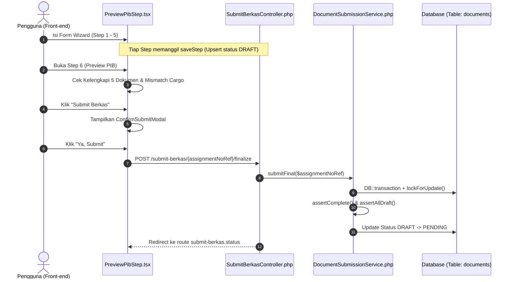

# Dokumentasi Teknis Alur Submit Berkas (PIB Submission Flow)

Dokumen ini berisi penjelasan komprehensif mengenai 3 komponen utama yang mengendalikan alur pengajuan dokumen PIB (*Pemberitahuan Impor Barang*) pada sistem **GTD-MOVLOG-WEB**:
1. **Frontend UI Component**: `resources/js/Pages/SubmitBerkas/components/steps/PreviewPibStep.tsx`
2. **Backend Domain Service**: `app/Services/DocumentSubmissionService.php`
3. **Web HTTP Controller**: `app/Http/Controllers/Web/SubmitBerkasController.php`

---

## 1. Arsitektur Kebijakan & Alur Data (Overview Flow)

Alur penyerahan berkas menggunakan pendekatan **Step-by-Step Wizard** yang terdiri dari 6 langkah:
1. **Customer Selection / Assignment Initiation** (Generate `assignment_no_ref`)
2. **Bill of Lading (BL)**
3. **Commercial Invoice (CI)**
4. **Packing List (PL)**
5. **Certificate of Origin (COO) & Insurance**
6. **Preview PIB & Finalization** (`PreviewPibStep.tsx`)

---

## 2. Penjelasan Detail File

### 2.1. Backend Service: `DocumentSubmissionService.php`
- **Lokasi File**: `app/Services/DocumentSubmissionService.php`
- **Peran**: *Domain Service Layer* yang memuat seluruh logika transaksi, enkapsulasi aturan bisnis, serta validasi integritas data dokumen.

#### Konstanta Utama:
- `REQUIRED_DOCUMENT_COUNT = 5`: Jumlah dokumen wajib dalam satu paket assignment (BL, CI, PL, COO, Insurance).
- `STATUS_DRAFT = 'DRAFT'`: Status awal dokumen saat dalam pengisian.
- `STATUS_PENDING = 'PENDING'`: Status dokumen setelah difinalisasi dan menunggu verifikasi Supervisor.

#### Method & Logika Bisnis:
1. `generateAssignmentRef(): string`
   - Menghasilkan nomor referensi assignment unik dengan format `ASG-YYYYMMDD-XXXXXX` (misal: `ASG-20260824-A1B2C3`).
2. `saveStep(array $data, string $uploadedBy): Document`
   - Melakukan *upsert* (`updateOrCreate`) pada tabel `documents` berdasarkan kombinasi `assignment_no_ref` & `document_type_id`.
   - Menggunakan `DB::transaction()` untuk menjamin konsistensi data.
   - Mengunci `customer_id` melalui `assertCustomerLocked()`.
3. `getByAssignmentRef(string $assignmentNoRef)`
   - Mengambil seluruh dokumen yang terkait dengan `assignment_no_ref` beserta eager loading relasi `documentType`.
4. `submitFinal(string $assignmentNoRef): void`
   - Eksekusi finalisasi dalam transaksi atomik (`DB::transaction`).
   - Menggunakan `lockForUpdate()` untuk mencegah *race condition* (misal jika pengguna mengklik submit berulang kali secara cepat).
   - Memvalidasi kelengkapan (`assertComplete`) dan status draft (`assertAllDraft`).
   - Mengubah status seluruh dokumen dalam assignment dari `DRAFT` menjadi `PENDING`.
5. **Private Safeguard Methods**:
   - `assertComplete()`: Memeriksa apakah ke-5 jenis dokumen wajib telah diunggah dan tidak ada jenis yang terlewat.
   - `assertAllDraft()`: Mencegah *double-submission* jika dokumen sudah berstatus `PENDING` atau `VERIFIED`.
   - `assertCustomerLocked()`: Mencegah manipulasi data di mana dokumen terhubung ke `customer_id` yang berbeda dari assignment berjalan.

---

### 2.2. Web Controller: `SubmitBerkasController.php`
- **Lokasi File**: `app/Http/Controllers/Web/SubmitBerkasController.php`
- **Peran**: Controller Web / Inertia yang menangani endpoint HTTP dan menghubungkan request frontend ke `DocumentSubmissionService`.

#### Method & Responsibilitas:
1. `index(): Response`
   - Merender halaman utama wizard submission `SubmitBerkas/SubmitBerkas`.
2. `startAssignment(Request $request)`
   - Endpoint HTTP POST `/submit-berkas/start` untuk mengambil `assignment_no_ref` baru saat wizard dimulai.
3. `saveStep(SaveDocumentStepRequest $request)`
   - Endpoint HTTP POST `/submit-berkas/step` untuk menyimpan/memperbarui data per step yang diisi pengguna.
4. `show(string $assignmentNoRef)`
   - Endpoint HTTP GET `/submit-berkas/{assignmentNoRef}` untuk mengambil data seluruh dokumen dalam assignment (digunakan saat *resume wizard* setelah reload/koneksi terputus).
5. `finalize(string $assignmentNoRef)`
   - Endpoint HTTP POST `/submit-berkas/{assignmentNoRef}/finalize` untuk mengeksekusi finalisasi dokumen.
   - Mengarahkan balik pengguna ke halaman status (`submit-berkas.status`) dengan pesan sukses.
6. `status(string $assignmentNoRef): Response`
   - Endpoint HTTP GET `/submit-berkas/{assignmentNoRef}/status` yang merender halaman status pengajuan (`SubmitBerkas/Status`).

---

### 2.3. Frontend Component: `PreviewPibStep.tsx`
- **Lokasi File**: `resources/js/Pages/SubmitBerkas/components/steps/PreviewPibStep.tsx`
- **Peran**: Komponen UI React (Step 6 dari Wizard SubmitBerkas) yang berfungsi sebagai ringkasan akhir data PIB sebelum disubmit ke backend.

#### Fitur & Komponen Utama:

1. **Pemeriksaan Kelengkapan Data (`Completeness Check`)**:
   - Memvalidasi keberadaan dan pengisian bidang-bidang kunci pada 5 dokumen:
     - `BL`: nomor & tanggal dokumen.
     - `CI`: nomor dokumen & list cargo.
     - `PL`: nomor dokumen & list cargo.
     - `COO`: nomor & tanggal dokumen.
     - `Insurance`: ketersediaan data dokumen.
   - Jika ada step yang belum lengkap, menampilkan **Alert Box Merah** di bagian atas beserta tombol pintas untuk langsung kembali ke step yang belum selesai (`goToStep(index)`).

2. **Kalkulasi & Penggabungan Data Cargo (`mergedCargo`)**:
   - Menggabungkan data item barang dari Commercial Invoice (`CI`) dan Packing List (`PL`) secara posisional berdasarkan indeks array.
   - **Peringatan Mismatch Item**: Menampilkan indikator jika jumlah item di CI dan PL berbeda (`cargoCountMismatch`), sehingga pengguna dapat menyadari potensi ketidaksesuaian *net weight*.
   - Menghitung total berat bersih (*Total Net Weight*) secara otomatis menggunakan `useMemo`.

3. **Modal Dialog Konfirmasi (`ConfirmSubmitModal`)**:
   - Komponen modal interaktif yang muncul sebelum request POST dikirim.
   - Menampilkan daftar *warnings* (seperti peringatan mismatch jumlah cargo) tanpa memblokir proses, melainkan memberikan kesempatan konfirmasi ulang kepada pengguna.

4. **Eksekusi Pengiriman (`handleConfirmSubmit`)**:
   - Memanggil `router.post('/submit-berkas/finalize', payload)` via Inertia.js.
   - Mengelola state interaktif `isSubmitting` (disable tombol & ganti teks menjadi "Mengirim...") dan menangani pesan galat (`submitError`).

---

## 3. Matriks Hubungan Antar File

| Fitur / Aksi | `PreviewPibStep.tsx` (Frontend) | `SubmitBerkasController.php` (Web Controller) | `DocumentSubmissionService.php` (Service) |
|---|---|---|---|
| **Inisialisasi Assignment** | Menerima `assignment_no_ref` dari konteks wizard. | `startAssignment()` (POST `/submit-berkas/start`) | `generateAssignmentRef()` |
| **Simpan Tiap Step** | User klik "Simpan & Lanjut" di Step 1-5. | `saveStep()` (POST `/submit-berkas/step`) | `saveStep()` (upsert `STATUS_DRAFT`) |
| **Resume Data / Preview** | Mengambil `wizardData` dari `useWizard()`. | `show()` (GET `/submit-berkas/{ref}`) | `getByAssignmentRef()` |
| **Finalisasi Submission** | Klik "Submit Berkas" -> `handleConfirmSubmit()` -> `router.post()` | `finalize()` (POST `/submit-berkas/{ref}/finalize`) | `submitFinal()` (`STATUS_DRAFT` -> `STATUS_PENDING`) |

---
*Dokumen ini dibuat otomatis sebagai referensi teknis pengembangan sistem GTD-MOVLOG-WEB.*
